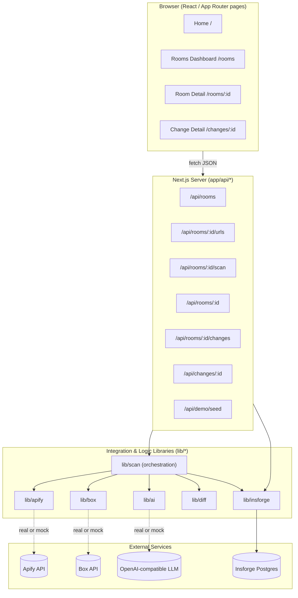

# Design Document

## Overview

PageVault is a Next.js (App Router) + TypeScript full-stack application that acts as an AI memory layer for the public web. A user creates a **Memory Room** for a target (company or website), adds **Watched URLs**, runs a **Scan**, and reviews AI-generated **Change Analyses** on a dashboard. The system is built around three external services, each wrapped in an integration library that degrades gracefully to a deterministic mock when its credentials are absent:

- **Apify** captures the web — crawls public pages and returns page content.
- **Box** stores the memory — persists every snapshot, the raw crawl output, and every generated report as durable evidence.
- **An OpenAI-compatible LLM** explains the change — compares page versions and produces a structured analysis.

Metadata for rooms, URLs, scan runs, snapshots, and analyses lives in an **Insforge** Postgres backend.

The central design constraint is **resilience**: PageVault must run reliably during a hackathon demo even when third-party credentials are missing or external calls fail. This is achieved by a uniform "credentials present → real call; credentials absent → mock" pattern in every integration library, with one deliberate asymmetry: when Box credentials *are* configured but a Box operation fails, the error propagates as a system error (evidence durability is a first-class guarantee), whereas Apify and AI failures always fall back to mock so a scan never dies on a flaky crawl or model call.

This document describes the architecture, the layered code structure, the data model and shared types, the integration library contracts and their mock-fallback strategy, the scan orchestration pipeline, the API route contracts, the error-handling strategy, the demo seed strategy, the frontend structure and theming, and a set of correctness properties for property-based testing of the pure logic layers.

### Tagline (visual copy)

> Apify captures the web. Box stores the memory. AI explains the change.

### Technology Stack

| Concern | Choice |
| --- | --- |
| Framework | Next.js (App Router) |
| Language | TypeScript |
| UI | React + Tailwind CSS 3.4 (pinned; do not upgrade to v4) |
| Database / backend | Insforge (Postgres + PostgREST) via `@insforge/sdk` |
| Web crawl | Apify API (`run-sync-get-dataset-items`) |
| Evidence storage | Box API (folders + file upload) |
| Change analysis | OpenAI-compatible Chat Completions API |
| Hashing | Node `crypto` (SHA-256) |

## Architecture

### High-Level Architecture



### Layered Responsibilities

PageVault follows a clean, layered architecture. Dependencies point inward: UI depends on API contracts, API routes depend on libraries, and libraries depend on external services through narrow, mockable interfaces.

1. **Presentation layer (`app/`, `components/`)** — React Server/Client Components render rooms, scans, and changes. Pages call internal API routes and never talk to external services directly.
2. **API layer (`app/api/`)** — Thin HTTP handlers that validate input, invoke the library layer, and shape JSON responses and error codes. Business orchestration is delegated to `lib/scan`.
3. **Integration & logic layer (`lib/`)** — The substance of the system:
   - `lib/insforge` — typed database access (the only module that touches Postgres).
   - `lib/apify`, `lib/box`, `lib/ai` — external service adapters with mock fallback.
   - `lib/diff` — pure content hashing and change detection.
   - `lib/scan` — orchestrates the end-to-end scan pipeline by composing the above.
4. **Types layer (`types/`)** — Shared TypeScript types used across all layers.

### Directory Structure

```
pagevault/
├── app/
│   ├── page.tsx                      # Home
│   ├── rooms/
│   │   ├── page.tsx                  # Rooms dashboard
│   │   ├── new/page.tsx              # Create room (page form; modal variant in components)
│   │   └── [roomId]/page.tsx         # Room detail
│   ├── changes/
│   │   └── [changeId]/page.tsx       # Change detail
│   └── api/
│       ├── rooms/route.ts            # POST create, GET list
│       ├── rooms/[roomId]/route.ts   # GET room detail
│       ├── rooms/[roomId]/urls/route.ts   # POST add URLs
│       ├── rooms/[roomId]/scan/route.ts   # POST run scan
│       ├── rooms/[roomId]/changes/route.ts# GET changes timeline
│       ├── changes/[changeId]/route.ts    # GET change detail
│       └── demo/seed/route.ts        # POST seed demo data
├── components/
│   ├── layout/ (Header, TaglineBanner, SetupBanner)
│   ├── rooms/ (RoomCard, CreateRoomForm, WatchedUrlList, ScanStatus)
│   ├── changes/ (ChangeTimeline, ChangeCard, SeverityBadge, EvidenceTable, RecommendedActions)
│   └── ui/ (Button, Modal, Badge, Card, EmptyState)
├── lib/
│   ├── insforge.ts                   # DB client + typed data-access helpers
│   ├── apify.ts                      # crawlUrls()
│   ├── box.ts                        # folder/file/url helpers
│   ├── ai.ts                         # analyzePageChange()
│   ├── diff.ts                       # hashContent(), hasMeaningfulChange()
│   ├── scan.ts                       # runScan() orchestration
│   ├── seed.ts                       # seedDemo()
│   ├── env.ts                        # credential detection helpers
│   └── validation.ts                 # input validation (rooms, urls)
├── types/
│   └── index.ts                      # MemoryRoom, WatchedUrl, PageSnapshot, ChangeAnalysis, ...
├── db/
│   └── migration.sql                 # schema (5 tables)
├── scripts/
│   └── seed-demo.ts                  # standalone demo seed runner
├── .env.example
└── README.md
```

## Components and Interfaces

### Credential Detection (`lib/env.ts`)

A single source of truth for whether each integration runs in real or Demo_Mode. A credential is "present" only when it is a non-empty string after trimming; a malformed value is still treated as present (it does not trigger Demo_Mode — it will surface as a real-call error per the requirements note).

```typescript
export const hasApifyCreds = (): boolean =>
  isPresent(process.env.APIFY_API_TOKEN) && isPresent(process.env.APIFY_ACTOR_ID);

export const hasBoxCreds = (): boolean =>
  isPresent(process.env.BOX_DEVELOPER_TOKEN) ||
  (isPresent(process.env.BOX_CLIENT_ID) && isPresent(process.env.BOX_CLIENT_SECRET));

export const hasAiCreds = (): boolean => isPresent(process.env.OPENAI_API_KEY);

export const hasInsforgeCreds = (): boolean =>
  isPresent(process.env.INSFORGE_API_URL) &&
  (isPresent(process.env.INSFORGE_SERVICE_ROLE_KEY) || isPresent(process.env.INSFORGE_ANON_KEY));

// isPresent(v) === typeof v === 'string' && v.trim().length > 0
```

### Database Access (`lib/insforge.ts`)

The only module that touches Postgres. It exposes a configured Insforge client plus typed data-access helpers so API routes and the orchestrator never write raw queries inline. Server-side writes use the service-role key.

```typescript
export function getDb(): InsforgeClient;            // throws InsforgeUnavailableError if no creds

// Rooms
createRoom(input: NewRoom): Promise<MemoryRoom>;
listRoomsWithStats(): Promise<RoomWithStats[]>;     // includes high/medium counts + lastScanAt
getRoom(roomId: string): Promise<MemoryRoom | null>;

// Watched URLs
addWatchedUrls(roomId: string, urls: NewWatchedUrl[]): Promise<WatchedUrl[]>;
listWatchedUrls(roomId: string): Promise<WatchedUrl[]>;

// Scan runs
createScanRun(roomId: string): Promise<ScanRun>;    // status 'running', started_at = now
completeScanRun(id: string): Promise<void>;
failScanRun(id: string, errorMessage: string): Promise<void>;
getLatestScanRun(roomId: string): Promise<ScanRun | null>;

// Snapshots
insertSnapshot(input: NewSnapshot): Promise<PageSnapshot>;
findPreviousSnapshot(watchedUrlId: string, beforeCapturedAt: string): Promise<PageSnapshot | null>;

// Change analyses
insertChangeAnalysis(input: NewChangeAnalysis): Promise<ChangeAnalysis>;
listChanges(roomId: string, limit?: number): Promise<ChangeAnalysis[]>;
getChange(changeId: string): Promise<ChangeAnalysis | null>;
countBySeverity(roomId: string): Promise<{ high: number; medium: number }>;
```

`InsforgeUnavailableError` is a distinct error type so the API/UI layer can render setup instructions (Requirement 15.2) rather than a generic failure.

### Apify Integration (`lib/apify.ts`)

```typescript
export interface ApifyPageResult {
  url: string;
  title?: string;
  text?: string;
  html?: string;
  markdown?: string;
  capturedAt: string;      // ISO 8601
}

export async function crawlUrls(urls: string[]): Promise<ApifyPageResult[]>;
```

Behavior:
- **Real mode** (`hasApifyCreds()` true): `POST https://api.apify.com/v2/acts/{APIFY_ACTOR_ID}/run-sync-get-dataset-items?token={APIFY_API_TOKEN}` with the URL list as actor input; map each returned dataset item to `ApifyPageResult`, always including `url` and `capturedAt`, and including `title`/`text`/`html`/`markdown` whenever the item provides them (Req 12.1, 12.3).
- **Mock mode** (creds absent): return deterministic mock results (Req 12.2). The mock dataset includes the documented before/after pricing-page versions:
  - before: contains "Unlimited projects included on Starter", "SSO included", "API access included"
  - after: contains "10 projects included on Starter", "SSO available on Enterprise", "API access available on Pro"
- **Failure fallback**: if the real call throws or returns a non-OK status, catch and return the mock results (Req 12.5). Apify never propagates a failure to the scan.

### Box Integration (`lib/box.ts`)

```typescript
export async function createBoxFolder(name: string, parentFolderId?: string): Promise<string>; // folderId
export async function uploadTextFileToBox(folderId: string, fileName: string, content: string): Promise<string>; // fileId
export function getBoxFolderUrl(folderId: string): string;
export function getBoxFileUrl(fileId: string): string;
```

Behavior:
- **Real mode** (`hasBoxCreds()` true): call the Box API.
  - Create folder: `POST https://api.box.com/2.0/folders` with `{ name, parent: { id: parentFolderId ?? BOX_ROOT_FOLDER_ID ?? "0" } }`.
  - Upload file: multipart `POST https://upload.box.com/api/2.0/files/content` with the `attributes` part *before* the `file` part; filenames sanitized (strip CR/LF, escape quotes).
  - URLs: `getBoxFolderUrl(id)` → `https://app.box.com/folder/{id}`; `getBoxFileUrl(id)` → `https://app.box.com/file/{id}`.
  - Auth header `Authorization: Bearer {token}` where token is `BOX_DEVELOPER_TOKEN` (hackathon path) or an OAuth-derived token.
- **Credentials present + operation fails**: propagate as a system error (`BoxSystemError`). Do **not** fall back to mock (Req 13.2). This is the deliberate asymmetry — evidence durability is guaranteed when Box is configured.
- **Credentials absent**: return deterministic mock identifiers and URLs (Req 13.3), e.g. `mock-folder-{slug}-{n}`, `mock-file-{slug}-{n}`, `https://app.box.com/folder/mock-...`. Never throws.

Folder layout the orchestrator builds on top of these primitives:
```
/PageVault/{room}/snapshots/{timestamp}/<page>.md
/PageVault/{room}/snapshots/{timestamp}/raw-apify-results.json
/PageVault/{room}/reports/<change>.md
```

### AI Integration (`lib/ai.ts`)

```typescript
export interface AnalyzeInput {
  url: string;
  pageType: PageType;
  previousText: string;
  currentText: string;
}

export interface ChangeAnalysisResult {
  severity: Severity;            // 'low' | 'medium' | 'high'
  changeType: ChangeType;
  summary: string;               // non-empty
  businessInterpretation: string;// non-empty
  evidence: EvidenceItem[];      // >= 1 item
  recommendedActions: string[];
}

export async function analyzePageChange(input: AnalyzeInput): Promise<ChangeAnalysisResult>;
```

Behavior:
- **Real mode** (`hasAiCreds()` true): call the OpenAI-compatible Chat Completions endpoint at `OPENAI_BASE_URL` with model `OPENAI_MODEL`, using the PageVault analyst prompt that instructs the model to return **JSON only** with keys `severity`, `change_type`, `summary`, `business_interpretation`, `evidence` (array of `{before, after, explanation}`), and `recommended_actions` (array). Parse the JSON and map to `ChangeAnalysisResult` (Req 14.1, 14.2).
- **Mock / fallback** — return a deterministic mock analysis when **any** of the following holds (Req 14.3, 14.4, 14.5):
  - credentials are absent, or
  - the LLM call fails (network/HTTP error), or
  - the response body cannot be parsed as the expected JSON object.
  The mock derives a sensible severity/type from the before/after text (e.g., detecting pricing keywords) so the demo reads coherently, and always returns ≥1 evidence item with non-empty summary and interpretation.

Note: `analyzePageChange` always resolves to a structurally valid `ChangeAnalysisResult`; it never rejects. Field-level normalization of out-of-range `severity`/`change_type` happens in the orchestrator (Req 7.8, 7.9) so persistence is always valid even if the model returns junk enum values.

### Diff Engine (`lib/diff.ts`)

```typescript
export function hashContent(text: string): string;                       // SHA-256 hex of normalized text
export function hasMeaningfulChange(previous: string, current: string): boolean; // hash(prev) !== hash(curr)
export function extractSimpleDiff(previous: string, current: string): SimpleDiff; // optional, line-level
```

`hashContent` normalizes before hashing (trim, collapse internal whitespace, normalize line endings) so that insignificant formatting noise does not register as change while real text differences do. `hasMeaningfulChange` is defined purely in terms of hash equality, guaranteeing it is consistent with the stored `content_hash` comparison used in the pipeline.

## Data Models

### Database Schema (Insforge Postgres)

Five tables. All ids are `uuid` primary keys defaulting to `gen_random_uuid()`. Timestamps are `timestamptz` defaulting to `now()`. Foreign keys to `memory_rooms` cascade on delete.

```sql
create table memory_rooms (
  id            uuid primary key default gen_random_uuid(),
  user_id       uuid,
  name          text not null,
  target_name   text not null,
  category      text not null default 'competitor',
  box_folder_id text,
  created_at    timestamptz not null default now()
);

create table watched_urls (
  id         uuid primary key default gen_random_uuid(),
  room_id    uuid not null references memory_rooms(id) on delete cascade,
  url        text not null,
  label      text,
  page_type  text default 'unknown',
  created_at timestamptz not null default now()
);

create table scan_runs (
  id            uuid primary key default gen_random_uuid(),
  room_id       uuid not null references memory_rooms(id) on delete cascade,
  status        text not null default 'queued',  -- queued | running | completed | failed
  apify_run_id  text,
  started_at    timestamptz,
  completed_at  timestamptz,
  error_message text
);

create table page_snapshots (
  id            uuid primary key default gen_random_uuid(),
  room_id       uuid not null references memory_rooms(id) on delete cascade,
  watched_url_id uuid not null references watched_urls(id) on delete cascade,
  scan_run_id   uuid not null references scan_runs(id) on delete cascade,
  url           text not null,
  title         text,
  text_content  text,
  content_hash  text not null,
  box_file_id   text,
  captured_at   timestamptz not null default now()
);

create table change_analyses (
  id                    uuid primary key default gen_random_uuid(),
  room_id               uuid not null references memory_rooms(id) on delete cascade,
  watched_url_id        uuid not null references watched_urls(id) on delete cascade,
  previous_snapshot_id  uuid references page_snapshots(id),
  current_snapshot_id   uuid references page_snapshots(id),
  severity              text not null,
  change_type           text not null,
  summary               text not null,
  business_interpretation text,
  recommended_actions   jsonb not null default '[]',
  evidence              jsonb not null default '[]',
  report_box_file_id    text,
  created_at            timestamptz not null default now()
);

create index on watched_urls(room_id);
create index on scan_runs(room_id);
create index on page_snapshots(watched_url_id, captured_at);
create index on change_analyses(room_id, created_at desc, id desc);
```

### Shared TypeScript Types (`types/index.ts`)

```typescript
export type Category = 'competitor' | 'vendor' | 'policy' | 'docs' | 'custom';

export type PageType =
  | 'homepage' | 'pricing' | 'docs' | 'changelog'
  | 'careers' | 'terms' | 'privacy' | 'trust' | 'unknown';

export type Severity = 'low' | 'medium' | 'high';

export type ChangeType =
  | 'pricing' | 'positioning' | 'feature' | 'legal'
  | 'security' | 'hiring' | 'docs' | 'minor' | 'unknown';

export interface MemoryRoom {
  id: string;
  userId: string | null;
  name: string;
  targetName: string;
  category: Category;
  boxFolderId: string | null;
  createdAt: string;
}

export interface RoomWithStats extends MemoryRoom {
  highCount: number;
  mediumCount: number;
  lastScanAt: string | null;
}

export interface WatchedUrl {
  id: string;
  roomId: string;
  url: string;
  label: string | null;
  pageType: PageType;
  createdAt: string;
}

export interface PageSnapshot {
  id: string;
  roomId: string;
  watchedUrlId: string;
  scanRunId: string;
  url: string;
  title: string;
  textContent: string;
  contentHash: string;
  boxFileId: string | null;
  capturedAt: string;
}

export type ScanStatus = 'queued' | 'running' | 'completed' | 'failed';

export interface ScanRun {
  id: string;
  roomId: string;
  status: ScanStatus;
  apifyRunId: string | null;
  startedAt: string | null;
  completedAt: string | null;
  errorMessage: string | null;
}

export interface EvidenceItem {
  before: string;
  after: string;
  explanation: string;
}

export interface ChangeAnalysis {
  id: string;
  roomId: string;
  watchedUrlId: string;
  previousSnapshotId: string | null;
  currentSnapshotId: string | null;
  severity: Severity;
  changeType: ChangeType;
  summary: string;
  businessInterpretation: string | null;
  recommendedActions: string[];
  evidence: EvidenceItem[];
  reportBoxFileId: string | null;
  createdAt: string;
}

export interface ScanSummary {
  scanRunId: string;
  status: ScanStatus;
  snapshotsCaptured: number;
  changesCreated: number;
}
```

### Validation Rules (`lib/validation.ts`)

| Field | Rule | Requirement |
| --- | --- | --- |
| room name | required, 1–200 chars after trim, not whitespace-only | 1.1, 1.3 |
| target name | required, 1–200 chars after trim, not whitespace-only | 1.1, 1.3 |
| category | optional; empty/missing → `competitor` | 1.2 |
| URL entries array | 1–100 entries, non-empty | 3.1, 3.6 |
| url value | required, valid absolute http/https URL | 3.5 |
| label | optional; if present ≤ 200 chars | 3.2, 3.5 |
| page type | one of the 9 values; missing/invalid → `unknown` | 3.2, 3.3 |

Validation returns a structured result `{ ok: true, value } | { ok: false, field, message }` so API routes can map failures to `400` responses that identify the invalid field, without inserting any rows.

## Scan Orchestration

`lib/scan.ts#runScan(roomId)` is the core pipeline. It is deliberately structured so that the Scan_Run row exists before any fallible work begins, and any thrown error transitions the run to `failed` with a recorded message.

```mermaid
sequenceDiagram
    participant API as POST /api/rooms/:id/scan
    participant Scan as lib/scan.runScan
    participant DB as lib/insforge
    participant Apify as lib/apify
    participant Box as lib/box
    participant Diff as lib/diff
    participant AI as lib/ai

    API->>DB: getRoom(roomId)
    alt room not found
        DB-->>API: null
        API-->>API: 404 not-found (no scan_run inserted)
    end
    API->>Scan: runScan(room)
    Scan->>DB: createScanRun(roomId) [status=running, started_at=now]
    Scan->>DB: listWatchedUrls(roomId)
    alt no watched urls
        Scan->>DB: completeScanRun(id)
        Scan-->>API: {status: completed, snapshots: 0, changes: 0}
    else has urls
        Scan->>Apify: crawlUrls(urls)
        Apify-->>Scan: ApifyPageResult[] (real or mock)
        Scan->>Box: uploadTextFileToBox(folder, "raw-apify-results.json", json)
        loop each result
            Scan->>Scan: normalize = markdown ?? text
            Scan->>Diff: hashContent(normalize)
            Scan->>DB: insertSnapshot(...)
            Scan->>Box: uploadTextFileToBox(snapshots/{ts}, page.md, content)
            Scan->>DB: findPreviousSnapshot(watchedUrlId, capturedAt)
            alt previous exists AND hashes differ
                Scan->>AI: analyzePageChange(...)
                Scan->>Scan: normalize severity/change_type enums
                Scan->>DB: insertChangeAnalysis(...)
                Scan->>Box: uploadTextFileToBox(reports, change.md, report)
            end
        end
        Scan->>DB: completeScanRun(id) [completed_at=now]
        Scan-->>API: {status: completed, snapshots: N, changes: M}
    end
    Note over Scan,DB: any throw → failScanRun(id, message); status=failed
```

Key ordering and correctness points:
- The Scan_Run is created with status `running` **before** any crawl (Req 4.1). For a room with no Watched URLs the run is marked `completed` without crawling and returns zero counts (Req 4.9).
- Each result is normalized using markdown when present, otherwise plain text (Req 4.4). Title defaults to empty string when absent (Req 5.2).
- The `{timestamp}` segment of the Box snapshot path is derived from the Scan_Run's `started_at`, so the snapshot markdown files and `raw-apify-results.json` share one folder (Req 5.3, 5.4).
- The previous snapshot is the latest snapshot for that Watched_URL strictly earlier than the current capture time (Req 5.5). When none exists, the current snapshot is retained and no analysis is created (Req 5.6, 6.2).
- A Change_Analysis is requested **exactly once** per Watched_URL only when a previous snapshot exists and hashes differ (Req 6.1, 6.3, 6.4).
- After AI returns, severity outside `{low, medium, high}` is stored as `low` and change_type outside the defined set is stored as `unknown`, with all other fields stored unchanged (Req 7.8, 7.9).
- Any failure after the Scan_Run is created flips status to `failed` and records `error_message`; status never becomes `completed` on failure (Req 4.7). Because Box errors propagate when configured, a real Box outage correctly fails the scan rather than silently losing evidence.

## API Routes

All routes return JSON. Errors use a consistent envelope `{ error: { code, message, field? } }` with HTTP status codes: `400` validation, `404` not-found, `500` system error, `503` Insforge unavailable.

| Route | Method | Request | Success response | Errors |
| --- | --- | --- | --- | --- |
| `/api/rooms` | POST | `{ name, targetName, category?, urls? }` | `201` created `MemoryRoom` | 400 invalid field (1.3); 500 Box folder failure (1.6) |
| `/api/rooms` | GET | — | `200` `RoomWithStats[]` (empty when none) | 500 retrieval failure (2.5) |
| `/api/rooms/:roomId` | GET | — | `200` `{ room, watchedUrls, latestScan, changes[≤20] }` | 404 (8.3) |
| `/api/rooms/:roomId/urls` | POST | `{ urls: [{ url, label?, pageType? }] }` | `201` `WatchedUrl[]` | 404 room (3.4); 400 invalid entry / count (3.5, 3.6) |
| `/api/rooms/:roomId/scan` | POST | — | `200` `ScanSummary` | 404 room (4.8); 500 scan failed (4.7) |
| `/api/rooms/:roomId/changes` | GET | — | `200` `ChangeAnalysis[]` (most-recent-first, tie-break id desc) | 404 room (9.3) |
| `/api/changes/:changeId` | GET | — | `200` `ChangeAnalysis` detail | 404 (10.2) |
| `/api/demo/seed` | POST | — | `200` `{ roomId }` | 503 Insforge unavailable |

Creating a room also creates its Box folder `/PageVault/{name}` and stores `box_folder_id` (Req 1.4, 1.5). Listing rooms includes high/medium change counts and last completed scan time (Req 2.2–2.4).

## Error Handling

The system distinguishes **recoverable** integration failures (degrade to mock) from **fatal** ones (fail the operation), and **infrastructure** failures (show setup guidance).

| Source | Credentials absent | Credentials present + failure |
| --- | --- | --- |
| Apify | mock crawl results (12.2) | mock crawl results (12.5) — never fails the scan |
| Box | mock ids/urls (13.3) — never throws | propagate `BoxSystemError` (13.2) — fails the operation |
| AI | mock analysis (14.3) | mock analysis on call failure or unparseable JSON (14.4, 14.5) |
| Insforge | `InsforgeUnavailableError` → UI setup instructions (15.2) | error surfaced; no partial data (2.5) |

Principles:
- **Demo_Mode is per-integration and credential-driven.** Missing credentials for one service do not affect others; a scan can crawl via mock Apify, store via real Box, and analyze via mock AI all in one run (Req 15.1, 15.3).
- **Demo_Mode triggers only on completely absent credentials, not malformed ones.** A malformed key attempts a real call and surfaces a real error (per requirements note).
- **Box is the one integration that fails loud when configured**, because the product's promise is durable evidence. Apify and AI always have a usable fallback, so they fail soft.
- **The scan is transactional in spirit, not in storage.** A mid-pipeline failure marks the run `failed` with a diagnostic `error_message`; already-inserted snapshots remain (they are valid evidence), but the run is not reported as `completed`.
- **Frontend never throws on missing data.** Room detail renders its layout with placeholders for any unavailable section (Req 8.5), and change detail renders a not-found indication without showing analysis fields (Req 10.4).

## Demo Seed Strategy

`lib/seed.ts#seedDemo()` (invoked by `POST /api/demo/seed` and by `scripts/seed-demo.ts`) builds a complete, presentation-ready room without requiring any external credentials:

1. Create a `DemoCo` Memory_Room (category `competitor`) and its Box folder (Req 11.1).
2. Add five Watched_URLs: Homepage, Pricing, Security Docs, Changelog, Careers (Req 11.1).
3. For each URL that has a demo change, insert a **previous** and **current** Page_Snapshot with distinct content hashes (Req 11.2).
4. Insert Change_Analysis records for the documented demo changes (Req 11.3):
   - Pricing: "Unlimited projects" → "10 projects"
   - SSO: Starter → Enterprise
   - API access: Starter → Pro
   - Homepage positioning: "for small teams" → "for modern enterprises"
   - Careers: added "Enterprise Account Executive"
5. Each demo analysis sets a business interpretation describing **DemoCo moving upmarket** and includes the recommended actions: update the competitive battlecard, review vendor renewal risk, ask whether existing customers are grandfathered, and monitor future pricing changes (Req 11.4).
6. Return the seeded room id (Req 11.5).

**Partial-seed tolerance**: each snapshot/analysis insert is wrapped so that if an individual record fails, seeding logs the failure, skips that record, and continues; the operation still returns the room id with whatever records succeeded (Req 11.6).

## Frontend Design

A memory-vault themed, dark/neutral SaaS dashboard built with Tailwind CSS. The tagline "Apify captures the web. Box stores the memory. AI explains the change." appears as visual copy on the home page.

### Pages

- **Home (`/`)** — product name PageVault, tagline "AI memory for the changing web", `Create Memory Room` and `Load Demo` controls (Req 16.1). `Load Demo` calls `/api/demo/seed` then routes to the seeded room (Req 16.2).
- **Rooms dashboard (`/rooms`)** — one `RoomCard` per room showing name, target, category, last scan time, high/medium change counts, an Open Room control, and an Open Box Folder link (Req 16.3).
- **Create room (`/rooms/new` + modal variant)** — fields for name, target, category, and a repeatable URL row (url + label + pageType) with example defaults pre-filled to speed the demo.
- **Room detail (`/rooms/:roomId`)** — room title, target name, Watched_URLs, `Run Scan` control, `Open Box Folder` control linked via `getBoxFolderUrl`, latest scan status, and a changes timeline of the 20 most recent analyses (Req 8.4, 8.6). Missing/failed data renders placeholders, never an unhandled error (Req 8.5).
- **Change detail (`/changes/:changeId`)** — severity, change type, summary, business interpretation, a before/after evidence table (before, after, explanation per row), recommended actions, and a Box report link via `getBoxFileUrl` (Req 10.3). Not-found renders a clear "change does not exist" state with no analysis fields (Req 10.4).

### Shared Components & Theming

- `SeverityBadge` — color-coded badge (low/medium/high) used in timeline cards and change detail (Req 9.4).
- `ChangeTimeline` / `ChangeCard` — render one card per analysis in returned order; each card shows severity badge, change type, summary, page url, creation time, and recommended-action count (Req 9.4). Empty timeline shows placeholder content with no cards (Req 9.5).
- `EvidenceTable` — before/after/explanation rows for change detail.
- `SetupBanner` — shown when the Insforge backend is unavailable, describing required configuration (Req 15.2).
- Tailwind theme: dark neutral background, subtle vault/archive accent, monospace touches for hashes and URLs. Tailwind pinned to 3.4.

## Correctness Properties

*A property is a characteristic or behavior that should hold true across all valid executions of a system — essentially, a formal statement about what the system should do. Properties serve as the bridge between human-readable specifications and machine-verifiable correctness guarantees.*

PageVault contains substantial pure logic that is well-suited to property-based testing: the diff engine (hashing/change detection), the input validation and normalization rules, the integration mock-fallback contracts, and the in-memory scan-pipeline invariants. The properties below are written to be implemented as property-based tests (≥100 iterations each), with external services replaced by in-memory fakes so the scan logic is tested independently of I/O. UI rendering, Box/Apify/LLM network behavior, and database wiring are covered by example-based and integration tests instead (see Testing Strategy).


The following properties were derived from the prework analysis and consolidated to remove redundancy (e.g., the several credential-absent/failure fallback criteria collapse into per-integration resilience properties; the severity and change-type normalization criteria collapse into one enum-normalization property; ordering/limit and empty-input criteria collapse into single sorting properties).

### Property 1: Content-hash change detection is exactly hash inequality and is insensitive to formatting

*For any* pair of text contents `(previous, current)`, `hasMeaningfulChange(previous, current)` returns true if and only if `hashContent(previous) !== hashContent(current)`; `hashContent` is deterministic (equal inputs yield equal hashes); and contents that differ only by normalized-away formatting (surrounding/collapsible whitespace, line-ending style) produce equal hashes and are reported as no meaningful change.

**Validates: Requirements 5.1, 6.1**

### Property 2: Category normalization defaults to 'competitor'

*For any* create-room input, the normalized category equals `competitor` when the provided category is missing, empty, or whitespace-only, and equals the provided category otherwise.

**Validates: Requirements 1.2**

### Property 3: Page-type normalization

*For any* page-type input, the normalized page type equals the provided value when it is one of `homepage`, `pricing`, `docs`, `changelog`, `careers`, `terms`, `privacy`, `trust`, `unknown`, and equals `unknown` otherwise (including when missing). A valid label of 1–200 characters is preserved unchanged.

**Validates: Requirements 3.2, 3.3**

### Property 4: Room field validation

*For any* name and target-name values, room validation rejects and identifies the offending field exactly when a value is missing, empty, whitespace-only, or longer than 200 characters, and accepts otherwise; a rejected input causes no row insertion.

**Validates: Requirements 1.3**

### Property 5: URL-batch validation is all-or-nothing across boundaries

*For any* add-URLs batch, the request is rejected with zero rows inserted when the batch is empty, contains more than 100 entries, or contains any entry whose url is missing or not a valid absolute http/https URL or whose label exceeds 200 characters; and is accepted only when every entry is valid and the count is 1–100.

**Validates: Requirements 3.5, 3.6**

### Property 6: Add-URLs preserves count and room association

*For any* valid batch of 1–100 URL entries added to an existing room, the number of inserted `watched_urls` rows equals the number of entries and every inserted row references that room.

**Validates: Requirements 3.1**

### Property 7: Severity counts aggregation

*For any* set of Change_Analysis records belonging to a room, the room's reported `highCount` equals the number of records with severity `high` and `mediumCount` equals the number with severity `medium`, each defaulting to zero when no such records exist.

**Validates: Requirements 2.2**

### Property 8: Last-scan time selection

*For any* set of Scan_Runs for a room, the reported last-scan time equals the maximum `completed_at` among runs with status `completed`, and is absent when no completed run exists.

**Validates: Requirements 2.3, 2.4**

### Property 9: Previous-snapshot selection

*For any* set of Page_Snapshots for a Watched_URL and a current snapshot, the selected previous snapshot is the one with the latest capture time among those strictly earlier than the current snapshot's capture time, and is absent when no strictly-earlier snapshot exists.

**Validates: Requirements 5.5, 5.6, 6.2**

### Property 10: Snapshot field construction with title defaulting

*For any* normalized crawl result, the constructed Page_Snapshot carries the room id, watched-url id, scan-run id, url, text content, and a content hash, and its title is the empty string exactly when the crawl result provides no title.

**Validates: Requirements 5.2**

### Property 11: Normalized content prefers markdown over text

*For any* crawl result, the normalized content equals the result's markdown when markdown is present and non-empty, and equals the result's plain text otherwise.

**Validates: Requirements 4.4**

### Property 12: Same-folder evidence consistency

*For any* completed scan, the `{timestamp}` folder segment used to store `raw-apify-results.json` equals the `{timestamp}` folder segment used to store every Page_Snapshot markdown file of that scan, derived from the single Scan_Run start time.

**Validates: Requirements 5.4, 5.3**

### Property 13: Analysis-creation invariant

*For any* Watched_URL processed in a scan, a Change_Analysis is created (and the AI_Analyzer invoked) exactly once when a previous snapshot exists and its content hash differs from the current snapshot's hash, and is not created at all when no previous snapshot exists or the hashes are equal.

**Validates: Requirements 6.3, 6.4, 5.6, 6.2**

### Property 14: Persisted enum normalization preserves other fields

*For any* analyzer result, the persisted Change_Analysis severity equals the returned severity when it is in `{low, medium, high}` and equals `low` otherwise, and the persisted change type equals the returned change type when it is in the defined Change_Type set and equals `unknown` otherwise; all remaining returned fields are stored unchanged.

**Validates: Requirements 7.8, 7.9**

### Property 15: Analyzer always produces a structurally valid result

*For any* analyze input — and regardless of whether credentials are absent, the LLM call fails, the response is unparseable, or the response is valid JSON — `analyzePageChange` resolves (never rejects) to a result whose severity is in `{low, medium, high}`, whose change type is in the defined set, whose summary and business interpretation are non-empty, whose evidence array contains at least one item each having before, after, and explanation values, and whose recommended actions is an array.

**Validates: Requirements 7.2, 14.2, 14.3, 14.4, 14.5**

### Property 16: Mock evidence is grounded in the provided texts

*For any* previous and current snapshot text, every Evidence_Item produced by the deterministic mock analyzer has a `before` value drawn from the previous text and an `after` value drawn from the current text.

**Validates: Requirements 7.5**

### Property 17: Apify crawl is resilient and well-shaped

*For any* list of URLs, `crawlUrls` resolves (never rejects) to results in which every result includes a url and a capture time and preserves whichever of title, text, html, and markdown are available; and when credentials are absent or the real API call fails, it returns the deterministic mock results without performing or completing a network call.

**Validates: Requirements 12.2, 12.3, 12.5**

### Property 18: Box client dual-mode behavior

*For any* folder or file operation, when Box credentials are absent the Box_Client returns mock identifiers and URLs and never throws; and when Box credentials are present and the underlying Box operation fails, the Box_Client propagates a system error and returns no mock identifier or URL.

**Validates: Requirements 13.2, 13.3**

### Property 19: Changes timeline ordering and limit

*For any* set of Change_Analysis records for a room, the timeline result is a permutation of those records sorted by creation time descending with ties broken by descending identifier; the room-detail changes result is the same ordering truncated to at most 20 records; and an empty input yields an empty result.

**Validates: Requirements 9.1, 9.2, 8.1**

### Property 20: Scan summary counts are accurate

*For any* scan over a room, the returned summary's captured-snapshot count equals the number of Page_Snapshots inserted during the run and its created-analysis count equals the number of Change_Analyses inserted during the run.

**Validates: Requirements 4.6**

### Property 21: Scan failure invariant

*For any* failure injected at any step after the Scan_Run is created, the run reaches terminal status `failed` with a non-empty `error_message` and never reaches status `completed`.

**Validates: Requirements 4.7**

### Property 22: End-to-end completion in Demo_Mode

*For any* combination of integration credential presence (Apify, Box, AI present or absent) and any set of Watched_URLs, a scan that encounters no configured-Box failure reaches terminal status `completed` and returns a structurally valid summary, using mock results for whichever integrations have absent credentials; a room with no Watched_URLs completes without invoking the crawl and reports zero captured snapshots and zero created analyses.

**Validates: Requirements 15.1, 15.3, 4.1, 4.9, 4.5**

### Property 23: Demo seed tolerates partial failure

*For any* subset of demo snapshot/analysis inserts that fail, the seed operation completes, returns the seeded room identifier, and creates all of the records whose inserts did not fail.

**Validates: Requirements 11.6**

## Error Handling Summary

The system normalizes all failures into the response envelope `{ error: { code, message, field? } }` and maps them to HTTP statuses as described in the API Routes and Error Handling sections. The decisive rules:

- Apify and AI failures are absorbed into deterministic mocks; they never fail a scan.
- Box failures fail loud only when Box is configured; otherwise they are mocked.
- Insforge unavailability is surfaced distinctly (`503` / `InsforgeUnavailableError`) so the UI can render setup instructions instead of a generic error.
- A scan failure marks the run `failed` with a diagnostic message and never reports `completed`.

## Testing Strategy

PageVault uses a dual testing approach. Property-based tests verify the pure logic and resilience contracts; example, snapshot, and integration tests cover concrete behaviors, UI rendering, external-service wiring, and seed content.

### Property-Based Testing

- **Library**: `fast-check` with Vitest (TypeScript). Do not hand-roll property testing.
- **Iterations**: each property test runs a minimum of 100 generated cases.
- **Isolation**: external services (Insforge, Apify, Box, LLM) are replaced with in-memory fakes/spies so the scan pipeline, validators, normalizers, diff engine, and integration fallbacks are tested as pure logic. Credential presence is simulated by toggling the `lib/env.ts` detectors.
- **Tagging**: every property test references its design property with a comment in the form
  `// Feature: pagevault, Property {number}: {property_text}`.
- **Coverage**: Properties 1–23 above. Fault injection (for Properties 17, 18, 21, 22, 23) is done by configuring the fakes to throw at specific steps.

### Example & Edge-Case Unit Tests

- Create-room success shape and Box-folder error propagation (1.1, 1.5, 1.6).
- List-rooms enumeration including the empty case (2.1) and retrieval-failure error (2.5).
- Not-found behaviors: add URLs (3.4), scan (4.8), room detail (8.3), changes (9.3), change detail (10.2).
- Mock-analyzer severity judgments: formatting-only → `low` (7.3); pricing/security → not `low` (7.4).
- Apify mock content strings (12.4).
- Demo seed content: DemoCo room and five URLs (11.1), previous/current snapshots (11.2), documented analyses (11.3), upmarket interpretation and four recommended actions (11.4), returned room id (11.5).

### Integration Tests (1–3 examples each)

- Apify real-mode call mapping (12.1), Box real-mode folder/upload/URL behavior and snapshot/report path placement (13.1, 13.4, 13.5, 5.3, 7.7), LLM real-mode request with the JSON-only analyst prompt (14.1), and the room-detail assembly bundling room/urls/latest-scan/changes (8.1).
- AI input wiring: analyzer receives url, page type, previous text, current text (7.1); change-analysis row carries all fields (7.6).

### UI / Snapshot Tests

- Home page elements and tagline (16.1) and Load-Demo flow (16.2).
- Rooms dashboard cards (16.3) and Open Box Folder link wiring (8.6).
- Room detail required elements (8.4) and placeholder resilience (8.5).
- Change timeline cards and ordering (9.4), empty-state placeholder (9.5).
- Change detail fields, evidence table, and Box report link (10.1, 10.3), and not-found state (10.4).
- Insforge-unavailable setup banner (15.2).

### Why parts of the system are not property-tested

Database CRUD wiring, Box/Apify/LLM network calls, React rendering, and fixed demo-seed content do not have meaningful "for all inputs" properties — their behavior does not vary with generated input in a way that 100 iterations would explore. These are covered by integration, example, and snapshot tests instead.

## Future Deliverables (built in the tasks phase)

- `README.md` — setup, environment variables, demo instructions, architecture summary.
- `.env.example` — all environment variables (`INSFORGE_API_URL`, `INSFORGE_ANON_KEY`, `INSFORGE_SERVICE_ROLE_KEY`, `APIFY_API_TOKEN`, `APIFY_ACTOR_ID`, `BOX_CLIENT_ID`, `BOX_CLIENT_SECRET`, `BOX_DEVELOPER_TOKEN`, `BOX_ROOT_FOLDER_ID`, `OPENAI_API_KEY`, `OPENAI_BASE_URL`, `OPENAI_MODEL`) with comments noting that missing credentials enable Demo_Mode.
- `db/migration.sql` — the five-table schema above with indexes.
- `scripts/seed-demo.ts` — standalone runner for `seedDemo()`.
