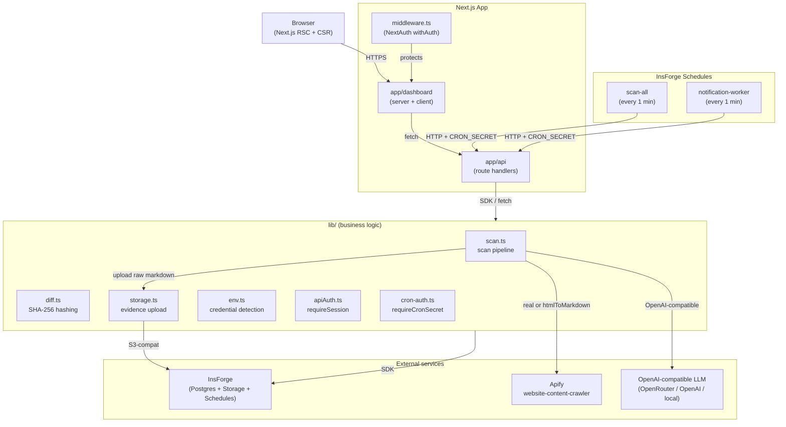

# PageVault — AI Memory Layer for the Web

> **Apify captures the web. InsForge Storage holds the memory. AI explains the change.**

PageVault is a Next.js 15 (App Router) + TypeScript full-stack application that
monitors public web pages, hashes every snapshot, asks an OpenAI-compatible
LLM to explain what changed and why, and keeps the raw markdown as durable
evidence. Apify does the crawling, the LLM does the explaining, and
InsForge Storage holds the evidence chain that makes the explanation
auditable.

## Documentation

The full developer reference lives in [`docs/00-INDEX.md`](docs/00-INDEX.md).
Start with the index, then read in this order for the fastest onboarding:

1. **[Architecture](docs/ARCHITECTURE.md)** — how the five planes (browser,
   InsForge, Apify, LLM, Storage, Schedules) fit together
2. **[Data model](docs/DATA_MODEL.md)** — every table, every column, ER
   diagram
3. **[Environment](docs/ENVIRONMENT.md)** — every env var, what enables
   which mode
4. **[API reference](docs/API.md)** — every route, every auth check,
   every error code
5. **[Component reference](docs/COMPONENTS.md)** — every component,
   props, when to use it
6. **[Development](docs/DEVELOPMENT.md)** — local setup, common tasks,
   debugging
7. **[Deployment](docs/DEPLOYMENT.md)** — Vercel + InsForge Schedules
8. **[Operations](docs/OPERATIONS.md)** — incident response
9. **[Security](SECURITY.md)** — reporting vulns, threat model

Additional reference material in `docs/`:

- **[ADRs](docs/adr/)** — Architecture Decision Records (MADR format).
  Read these before changing the stack, the mock-fallback contract, or
  the evidence-storage posture. The three shipped today:
  - [ADR-0001](docs/adr/0001-stack-choice.md) — why this stack
  - [ADR-0002](docs/adr/0002-mock-fallback-strategy.md) — credential-driven
    mock fallback
  - [ADR-0003](docs/adr/0003-evidence-storage.md) — why storage never
    mocks
- **[LLM model research](docs/LLM_MODEL_RESEARCH.md)** — the
  model-selection analysis behind `lib/scan.ts`.
- **[Codebase audit](docs/audits/2026-06-02-codebase-audit.md)** — the
  security and maintainability audit.
- **[Implementation plans](docs/plans/)** — the work that produced
  scheduled scans and notifications.

The original architectural spec lives at the repo root:
[`SYSTEM_DESIGN.md`](SYSTEM_DESIGN.md). It is the *design intent*;
[`docs/ARCHITECTURE.md`](docs/ARCHITECTURE.md) is the *implementation*
view.

## Architecture



A short, complementary text view (the "what links to what"):

```
Browser → Next.js App Router → API Routes → Library Layer
                                              ├── lib/scan      (orchestration: crawl → hash → diff → LLM)
                                              ├── lib/diff      (SHA-256 content hashing)
                                              ├── lib/storage   (InsForge Storage upload; NO mock fallback)
                                              ├── lib/insforge  (typed Postgres helpers)
                                              ├── lib/notifications (outbox pattern for cron delivery)
                                              ├── lib/auth      (NextAuth session)
                                              ├── lib/env       (credential detection, the isPresent primitive)
                                              └── lib/validation (input validation)
```

For the full five-plane view (browser, app, InsForge, Apify, LLM, cron)
see [`docs/ARCHITECTURE.md`](docs/ARCHITECTURE.md).

## Tech Stack

| Concern | Choice |
|---------|--------|
| Framework | Next.js 15 App Router |
| Language | TypeScript |
| UI | React + Tailwind CSS 3.4 (pinned) |
| Database | InsForge Postgres via `@insforge/sdk` |
| Evidence storage | InsForge Storage (S3-compatible bucket `pagevault-evidence`) |
| Web crawl | Apify `website-content-crawler` (or built-in HTML→Markdown fallback) |
| Change analysis | OpenAI-compatible Chat Completions API |
| Auth | NextAuth (route handlers use `requireSession()`, middleware gates `/dashboard/*`) |
| Scheduled work | InsForge Schedules (`scan-all` + `notification-worker`, every 1 min) |
| Testing | Vitest + fast-check |
| Hashing | Node `crypto` (SHA-256) |

## Key Design Patterns

### Credential-Driven Mock Fallback

Every external integration operates in two modes:

- **Real mode**: credentials present → real API call
- **Mock mode**: credentials absent → deterministic mock (never throws on absence)

`lib/storage.ts` is the deliberate exception: when InsForge Storage credentials are
present but a storage operation fails, the error propagates to the caller. There
is no mock-storage surface — the storage module is structurally incapable of
returning a fake URL. See [ADR-0003](docs/adr/0003-evidence-storage.md) for the
durability rationale.

### Demo Mode

The application runs with **partial** credentials. The first-run experience is
deterministic based on which keys are set:

- Missing InsForge keys → `InsforgeUnavailableError` (with setup instructions
  naming the missing keys)
- Missing `APIFY_API_TOKEN` / `APIFY_ACTOR_ID` → built-in `htmlToMarkdown`
  fallback crawler (no JS rendering, no anti-bot handling)
- Missing `OPENAI_API_KEY` → deterministic mock explanation derived from the
  URL hash
- Missing `INSFORGE_ANON_KEY` (with `INSFORGE_SERVICE_ROLE_KEY` set) → hard
  error from `createStorageFolder()`. The service-role key is not sufficient
  for the storage SDK; see ADR-0003.

## Environment Variables

Copy `.env.example` to `.env.local` and fill in the keys you have. Missing
optional keys degrade to the corresponding mock or fallback (see Demo Mode
above). The full per-variable contract lives in
[`docs/ENVIRONMENT.md`](docs/ENVIRONMENT.md).

```bash
# InsForge (Postgres + Storage + Schedules) — required for persistence
INSFORGE_API_URL=https://your-project.us-east.insforge.app
INSFORGE_SERVICE_ROLE_KEY=your-service-role-key
INSFORGE_ANON_KEY=your-anon-key                # required even when SRK is set

# Apify (web crawling) — optional, enables real Apify actor runs
APIFY_API_TOKEN=your-apify-token
APIFY_ACTOR_ID=your-actor-id

# Cron auth — required for the scheduled-scan endpoints
CRON_SECRET=any-long-random-string            # must match what the
                                              # InsForge schedule sends

# OpenAI-compatible LLM (change analysis) — optional, enables real AI
OPENAI_API_KEY=your-api-key
OPENAI_BASE_URL=https://openrouter.ai/api/v1  # any OpenAI-compatible endpoint
OPENAI_MODEL=anthropic/claude-3.5-haiku       # model name at that endpoint
```

## Setup

```bash
# Install dependencies
npm install

# Run in development mode (works with zero credentials; runs in Demo Mode)
npm run dev

# Type check
npm run typecheck

# Lint
npm run lint

# Run tests
npm run test
npm run test:watch
npm run test:coverage

# Build for production
npm run build

# Start the production server
npm start
```

For the full developer workflow (debugging, conventions, common tasks) see
[`docs/DEVELOPMENT.md`](docs/DEVELOPMENT.md).

## Seeding demo data

There is no built-in "Demo Mode" button. To populate the database with realistic
seed data for a local walkthrough, run the seed script (requires the InsForge
service-role key in `.env.local`):

```bash
python3 scripts/seed_via_api.py
```

This writes projects, tracked pages, snapshot jobs, snapshots, and AI
explanations directly to the database. The seeded room is a complete
**DemoCo** competitor room with five watched URLs (Homepage, Pricing, Security
Docs, Changelog, Careers) and before/after snapshot pairs covering pricing
changes, tier migrations, and a new job posting.

For a live end-to-end run against the real Apify and LLM, see
`scripts/live_crawl_real_llm.py` and `scripts/eval_models.py`.

## API Routes

| Method | Endpoint | Auth | Description |
|--------|----------|------|-------------|
| GET | `/api/rooms` | session | List all rooms with stats |
| POST | `/api/rooms` | session | Create a new room |
| GET | `/api/rooms/[roomId]` | session | Room detail with URLs, scan, changes |
| POST | `/api/rooms/[roomId]/urls` | session | Add watched URLs to a room |
| POST | `/api/rooms/[roomId]/scan` | session | Run a scan on a room |
| GET | `/api/rooms/[roomId]/changes` | session | Changes timeline for a room |
| GET | `/api/rooms/[roomId]/schedule` | session | Read scan schedule for a room |
| POST | `/api/rooms/[roomId]/schedule` | session | Set or update a scan schedule |
| GET | `/api/rooms/[roomId]/notifications` | session | List webhook subscriptions |
| POST | `/api/rooms/[roomId]/notifications` | session | Add a webhook subscription |
| POST | `/api/rooms/[roomId]/notifications/[id]/test` | session | Send a test webhook |
| DELETE | `/api/rooms/[roomId]/notifications/[id]` | session | Remove a subscription |
| GET | `/api/changes/[changeId]` | session | Single change analysis detail |
| POST | `/api/cron/scan-all` | `CRON_SECRET` | Run all due scheduled scans |
| POST | `/api/cron/scan-room/[roomId]` | `CRON_SECRET` | Run a single room's scan |
| POST | `/api/cron/notification-worker` | `CRON_SECRET` | Drain the notification outbox |
| GET/POST | `/api/auth/[...nextauth]` | — | NextAuth handlers |

For the full request/response shape, error envelope, and rate limits see
[`docs/API.md`](docs/API.md).

## Project Structure

```
pagevault/
├── app/                          # Next.js App Router
│   ├── api/                      # Route handlers (session or CRON_SECRET)
│   │   ├── auth/[...nextauth]/   # NextAuth handler
│   │   ├── rooms/                # Rooms CRUD, URLs, scan, schedule, notifications
│   │   ├── changes/[changeId]/   # Change detail
│   │   └── cron/                 # scan-all, scan-room/[id], notification-worker
│   ├── dashboard/                # Authed pages (server + client)
│   ├── login/                    # Sign-in page
│   ├── layout.tsx                # Root layout
│   ├── page.tsx                  # Marketing home
│   └── globals.css               # Tailwind entrypoint
├── components/                   # React components
│   ├── dashboard/                # Dashboard-specific widgets
│   ├── providers/                # SessionProvider, theme, etc.
│   └── ui/                       # Generic primitives (Button, Card, etc.)
├── lib/                          # Business logic, no React
│   ├── scan.ts                   # Live scan pipeline
│   ├── diff.ts                   # SHA-256 content hashing
│   ├── storage.ts                # InsForge Storage upload (NO mock fallback)
│   ├── insforge.ts               # Typed Postgres helpers
│   ├── notifications.ts          # Outbox pattern for cron delivery
│   ├── auth.ts                   # NextAuth config
│   ├── apiAuth.ts                # requireSession() for route handlers
│   ├── cron-auth.ts              # requireCronSecret() for /api/cron/*
│   ├── env.ts                    # isPresent + has*Creds() primitives
│   ├── validation.ts             # Input validation
│   └── notifications/            # Channel-specific helpers
├── types/index.ts                # Shared TypeScript types
├── db/                           # SQL migrations
│   ├── migration.sql             # Base schema (7 tables)
│   └── migrations/               # Date-stamped feature migrations
├── scripts/                      # Standalone seed and eval runners
├── docs/                         # Full developer reference
│   ├── 00-INDEX.md
│   ├── ARCHITECTURE.md
│   ├── DATA_MODEL.md
│   ├── ENVIRONMENT.md
│   ├── API.md
│   ├── COMPONENTS.md
│   ├── DEVELOPMENT.md
│   ├── DEPLOYMENT.md
│   ├── OPERATIONS.md
│   ├── LLM_MODEL_RESEARCH.md
│   ├── audits/
│   ├── plans/
│   └── adr/                      # ← MADR-format ADRs (see ADR-0001..0003)
├── functions/                    # Edge function sources (e.g. apify webhook)
├── middleware.ts                 # NextAuth withAuth for /dashboard/*
├── next.config.js
├── tailwind.config.ts
├── vitest.config.ts
└── .env.example
```

## Scan Pipeline

Implemented in `lib/scan.ts`:

1. **Create snapshot job** — status `running`, `triggered_by` set
   (`manual` | `schedule` | `webhook`), `started_at` = now
2. **Load watched URLs** — if none, mark `succeeded` with zero counts
3. **Crawl URLs** — Apify when `APIFY_*` are set, else the built-in
   `htmlToMarkdown` fallback
4. **Hash & diff** — SHA-256 the rendered markdown. If the hash matches
   the previous snapshot, skip the LLM call (cost saver)
5. **For each changed URL**:
   - Insert `snapshots` row with the new hash
   - Upload the raw markdown to InsForge Storage
     (`pagevault-evidence/<room>/snapshots/<date>/<file>`)
   - Call the LLM with a tight prompt
   - Insert `ai_explanations` row
   - Upload the rendered explanation to storage
6. **Complete snapshot job** — `succeeded` with `snapshots_captured`
   and `changes_created` counts. On any error after step 1, the job
   is marked `failed` with an error message.

## Database Schema

See `db/migration.sql` and `db/migrations/`. Ten tables:

- `projects` — the rooms a user creates
- `tracked_pages` — URLs being monitored per project
- `snapshot_jobs` — a single scan run (manual, schedule, or webhook)
- `snapshots` — captured page content with content hashes
- `artifacts` — file references for storage evidence
- `ai_explanations` — LLM-generated change interpretations
- `webhook_events` — idempotency log for inbound Apify webhooks
- `notification_subscriptions` — outbound webhooks per room
- `notification_outbox` — the cron-worker drain queue
- `scan_schedules` — per-room cron expressions

The full ER diagram and column-level reference lives in
[`docs/DATA_MODEL.md`](docs/DATA_MODEL.md).

## Testing

```bash
# Run all tests once
npm run test

# Watch mode (recommended during TDD)
npm run test:watch

# Coverage report
npm run test:coverage

# Type check
npm run typecheck

# Lint
npm run lint
```

Tests use Vitest. Property-based tests (e.g. for the diff module) use
`fast-check`. Tests are colocated next to the code they cover (e.g.
`lib/diff.test.ts`).

## Deploy

The production deploy path is Vercel for the Next.js app and InsForge
Schedules for the cron triggers. The full sequence — environment
provisioning, secret rotation, schedule registration, smoke tests,
rollback — lives in [`docs/DEPLOYMENT.md`](docs/DEPLOYMENT.md).

The short version:

1. Push to `main`; Vercel builds and deploys.
2. In the InsForge dashboard, ensure the two scheduled functions
   (`scan-all`, `notification-worker`) are registered with `CRON_SECRET`
   set in their headers.
3. Smoke-test `POST /api/cron/scan-all` from the InsForge function
   console; expect a 200 and a `scan_jobs` row.

## Troubleshooting

A few issues we have already hit; the fix is here so the next person
doesn't re-discover it.

### "Storage is not configured" even though `INSFORGE_API_URL` is set

The storage SDK is built with the **anon key**, not the service-role
key. Setting only `INSFORGE_SERVICE_ROLE_KEY` produces this error. Set
`INSFORGE_ANON_KEY` too. The error message in `lib/storage.ts` calls
this out explicitly; the durable rationale is in
[ADR-0003](docs/adr/0003-evidence-storage.md).

### "Scan completes but I see no change analyses"

Two common causes:

1. The content hash matches the previous snapshot — the LLM call is
   intentionally skipped (cost saver). Look at the
   `ai_explanations` table; a row is only created when content
   actually changed.
2. The LLM call returned an error. The `snapshot_jobs` row will have
   `status = 'failed'`. Check `lib/scan.ts` logs.

### "Apify returns 401"

`APIFY_API_TOKEN` and `APIFY_ACTOR_ID` are *both* required.
`hasApifyCreds()` in `lib/env.ts` requires both. A malformed token is
still treated as "present" — the real-call path will surface the
401 from Apify.

### Cron returns 401

The InsForge schedule must send `CRON_SECRET` as a header (e.g.
`x-cron-secret: <value>`) and that value must match what's in the
app's environment. `requireCronSecret()` in `lib/cron-auth.ts` is the
gate; `docs/DEPLOYMENT.md` §"Scheduled scans" has the exact header
name.

### "Mermaid diagram in the README doesn't render"

The Mermaid block is fenced with ```` ```mermaid ````. GitHub, GitLab,
and most static-site generators render it. If your preview tool
doesn't, the ASCII tree immediately below the Mermaid block carries
the same information in a plain-text form.

### "I see mock LLM responses in production"

Check `OPENAI_API_KEY`. The credential-driven fallback (ADR-0002) means
a missing or empty key silently switches to a deterministic stub
derived from the URL hash. A "Mock analysis" banner in the UI is the
visual signal. In production, this is almost always a misconfigured
secret rather than a bug.

### "Tests pass locally but CI fails on `npm run lint`"

The CI workflow runs `lint`, `typecheck`, and `test` independently.
A lint failure surfaces only on the lint step. Run `npm run lint`
locally to reproduce.

## Architecture Decision Records

This repo's significant design decisions are tracked as ADRs in
[`docs/adr/`](docs/adr/), in MADR format. The three shipped today:

- **[ADR-0001](docs/adr/0001-stack-choice.md)** — Next.js + InsForge
  + Apify + OpenAI-compatible LLM + InsForge Storage
- **[ADR-0002](docs/adr/0002-mock-fallback-strategy.md)** — the
  credential-driven mock fallback, and why it is uniform across
  integrations except storage
- **[ADR-0003](docs/adr/0003-evidence-storage.md)** — why storage
  is the one integration that does not fall back to mock

When adding a new ADR, copy the YAML frontmatter from one of these,
increment the four-digit prefix, and follow the MADR body shape
(Context & Problem Statement → Decision Drivers → Considered Options
→ Decision Outcome → Consequences → Pros and Cons of the Options).

## Contributing

See [`CONTRIBUTING.md`](CONTRIBUTING.md) for branching, commit
conventions, the PR template, and code-review expectations. For
deeper developer workflow (debugging, conventions, common tasks) see
[`docs/DEVELOPMENT.md`](docs/DEVELOPMENT.md).

## Security

See [`SECURITY.md`](SECURITY.md) for the vulnerability reporting
channels, the threat model summary, and how secrets are managed. Do
**not** open a public GitHub issue for security findings.

## License

See [`LICENSE`](LICENSE).
