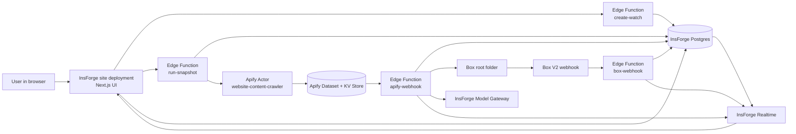
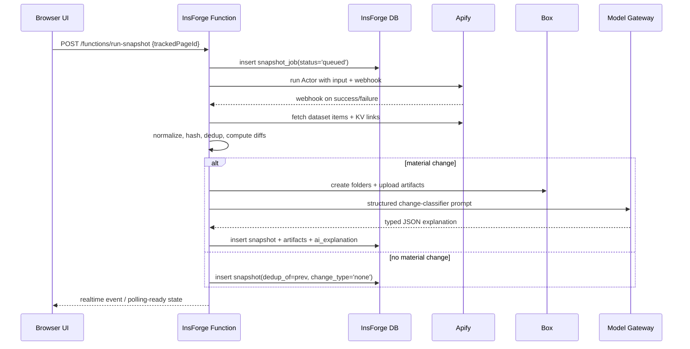

# PageVault

## Executive summary

PageVault works best as a **thin orchestration app** on InsForge, not as a monolithic crawler. The cleanest hackathon architecture is: a Next.js frontend deployed as an InsForge site; InsForge Postgres for watchlists, jobs, snapshots, and explanations; InsForge Edge Functions for orchestration; Apify Actors for crawling and screenshot capture; Box for immutable artifact storage and longitudinal archive; and an OpenAI-compatible model call through InsForge’s Model Gateway for structured explanations. This matches the documented strengths of each platform: InsForge provides Postgres, authentication, storage, realtime, edge functions, deployments, and an OpenAI-compatible model gateway; Apify provides Actors, datasets, key-value stores, and webhooks around crawler runs; Box provides server-side auth, uploads, metadata, and webhooked folder/file monitoring; and OpenAI supports structured JSON outputs and project-level rate/data controls. citeturn30search0turn19view0turn19view1turn19view2turn19view13turn19view14turn21view0turn24view2turn19view10turn19view17turn20view15

For a demo-focused, low-scale hackathon build, the highest-confidence approach is to use **Apify’s `apify/website-content-crawler`** for the default path, because it can capture cleaned Markdown, transformed HTML, linked files, and screenshots, and it exposes practical controls such as URL scopes, selectors, retries, concurrency, dynamic-content waits, robots.txt checks, and screenshot storage. Use **`playwright:firefox`** when you need screenshots or dynamic rendering, and **`cheerio`** when you want cheaper and faster text-only snapshots. Keep `maxCrawlPages` low, enable `saveMarkdown`, `saveHtmlAsFile`, and optionally `saveScreenshots`, and prefer asynchronous runs plus webhooks once a run might exceed a few minutes. citeturn21view0turn33view1turn34view3turn35view0turn21view3turn21view4

For Box, the most robust storage pattern is **immutable timestamped snapshot folders**, optionally paired with “latest” alias files that get new Box file versions uploaded to stable filenames. That hybrid preserves a user-friendly latest preview while avoiding total dependence on Box native version-history semantics, which Box documents as plan-dependent for premium accounts. Demo auth can use a Developer Token, but production should use server-side JWT auth with a token cache and only the scopes required for files/folders and, if used, webhooks. If you embed Box previews in the browser, exchange for a downscoped token rather than shipping a full access token client-side. citeturn20view1turn19view6turn24view2turn20view2turn19view10turn19view11turn20view7turn20view5turn24view0

The AI layer should be **schema-constrained and evidence-bound**. Use Structured Outputs so the classifier, explanation generator, and longitudinal “trajectory” summarizer all return typed JSON. The model should never infer a change without citing the specific old/new text spans or DOM nodes that triggered the judgment; when evidence is weak, it should return `unknown` or `insufficient_evidence`. On cost, GPT-4.1 mini is the right default for hackathon explanation calls because its input/output pricing is far lower than GPT-4.1 proper, while still supporting structured generation. Data sent to the OpenAI API is not used for training by default unless you opt in, and project-level data-retention controls exist for stricter environments. citeturn19view17turn22view2turn22view3turn20view13turn20view15

## System architecture

The core design principle is to keep **control-plane state in InsForge** and **evidence-plane artifacts in Box**. InsForge natively gives you Postgres, RLS-bound auth, edge functions, realtime channels, and an OpenAI-compatible gateway; Apify gives you crawler execution plus structured run outputs; Box gives you durable content storage, metadata, and folder/file events. citeturn21view11turn19view3turn22view11turn19view5turn19view2turn19view13turn21view0turn24view2



### Component responsibilities

| Component | Recommended responsibility | Why this split works |
|---|---|---|
| InsForge site | Authenticated UI, page history, diff tabs, manual trigger buttons | Keeps user flows close to InsForge auth and deployments |
| InsForge Postgres | Projects, tracked pages, jobs, snapshots, artifacts, webhook receipts, AI outputs | InsForge tables are first-class REST/SDK endpoints with RLS |
| InsForge Edge Functions | Secrets-bearing orchestration and webhook ingest | Functions support HTTP triggers, schedules, DB triggers, secrets, and logs |
| Apify Actor | Fetch page text/HTML/screenshot and emit dataset items | Apify is optimized for crawling, retries, proxies, and browser/HTTP execution |
| Box | Store immutable artifacts and optionally stable alias files | Better archive/preview experience than shoving blobs into SQL |
| OpenAI via InsForge Model Gateway | JSON-classified change summaries and trajectories | Model Gateway centralizes provider keys and usage |

This table is a design recommendation built on documented platform capabilities: InsForge Functions are HTTP-triggered Deno functions with schedules, DB triggers, per-function secrets, and structured logs; InsForge Realtime can fan out to connected clients and webhook URLs; Apify run results are typically retrieved from datasets and key-value stores; and Box is optimized for file/folder APIs, metadata, previews, uploads, and webhooks. citeturn22view11turn19view1turn19view5turn19view13turn19view10turn20view6

### Sequence and data flow

Use **asynchronous Apify runs + Apify webhooks** for the normal path. Apify’s synchronous task endpoint is convenient, but the documented behavior is that it times out after 300 seconds if the run has not finished, even though the run itself continues. That makes sync calls suitable only for demo mode or one-page captures. Normal flow should be: create job in Postgres, start Apify Actor run, receive an Apify webhook on success/failure, fetch dataset items using `defaultDatasetId`, pull HTML/screenshot files from Apify KV links when enabled, hash and deduplicate, upload artifacts to Box, call the LLM, and then mark the snapshot ready for Realtime/UI consumption. citeturn21view3turn19view13turn19view14turn21view4



### UI wireframes and key screens

The UI only needs four screens for a strong hackathon demo. The first is a **Watchlist Dashboard** with a table of tracked URLs, last check time, last change status, and quick actions for “Snapshot now,” “Open history,” and “Open in Box.” The second is a **Tracked Page Detail** view with a timeline of snapshot cards and three tabs: **Text diff**, **DOM diff**, and **Visual diff**, plus the AI explanation panel and raw evidence snippets. The third is a **New Watch Modal** with fields for URL, crawl engine, selectors to keep/remove, frequency, and a Box destination. The fourth is a **Run/Debug screen** showing crawl status, function logs, latest screenshot, and webhook receipt history. If you later embed Box preview directly in the app, use a downscoped token for that browser session. citeturn20view5turn19view5turn19view1

## Data model and interfaces

InsForge’s database model is well-suited to PageVault because every project gets Postgres, every table is exposed as a typed REST/SDK endpoint, and RLS policies apply across database, storage, and realtime. That means the frontend can directly read watchlists and histories under normal user auth, while privileged write paths stay behind Edge Functions. citeturn21view11turn19view3

### Recommended schema

| Table | Core columns | Key indexes | Notes |
|---|---|---|---|
| `projects` | `id`, `owner_id`, `name`, `box_root_folder_id`, `created_at` | PK, `idx_projects_owner` | One logical workspace |
| `tracked_pages` | `id`, `project_id`, `source_url`, `normalized_url`, `slug`, `box_page_folder_id`, `active`, `created_at` | `uniq_project_normalized_url`, `idx_tracked_pages_project` | One watch target |
| `snapshot_jobs` | `id`, `tracked_page_id`, `trigger_type`, `status`, `apify_run_id`, `apify_dataset_id`, `error_code`, `error_message`, `requested_at`, `finished_at` | `idx_jobs_page_requested`, `idx_jobs_status_requested` | Execution audit |
| `snapshots` | `id`, `tracked_page_id`, `job_id`, `observed_at`, `final_url`, `canonical_url`, `page_title`, `http_status`, `markdown_hash`, `html_hash`, `screenshot_phash`, `change_type`, `dedup_of_snapshot_id`, `box_snapshot_folder_id` | `idx_snapshots_page_observed`, `idx_snapshots_hashes`, `idx_snapshots_change_type` | One observation per run |
| `artifacts` | `id`, `snapshot_id`, `kind`, `box_file_id`, `box_file_version_id`, `sha256`, `bytes`, `mime_type`, `box_path` | `idx_artifacts_snapshot_kind`, `idx_artifacts_box_file_id` | HTML, Markdown, PNG, JSON |
| `ai_explanations` | `id`, `snapshot_id`, `previous_snapshot_id`, `model`, `prompt_version`, `output_json`, `confidence`, `created_at` | `uniq_ai_explanation_snapshot`, `idx_ai_model_created` | Typed LLM outputs |
| `webhook_events` | `id`, `source`, `external_event_id`, `payload_sha256`, `received_at`, `processed_at`, `status` | `uniq_source_external_event`, `idx_webhooks_source_received` | Idempotency + replay defense |

### Sample SQL

```sql
create extension if not exists pgcrypto;

create table public.projects (
  id uuid primary key default gen_random_uuid(),
  owner_id uuid not null references auth.users(id),
  name text not null,
  box_root_folder_id text,
  created_at timestamptz not null default now()
);

create table public.tracked_pages (
  id uuid primary key default gen_random_uuid(),
  project_id uuid not null references public.projects(id) on delete cascade,
  source_url text not null,
  normalized_url text not null,
  slug text not null,
  box_page_folder_id text,
  active boolean not null default true,
  created_at timestamptz not null default now(),
  unique (project_id, normalized_url)
);

create table public.snapshot_jobs (
  id uuid primary key default gen_random_uuid(),
  tracked_page_id uuid not null references public.tracked_pages(id) on delete cascade,
  trigger_type text not null check (trigger_type in ('manual','schedule','box_webhook','retry')),
  status text not null check (status in ('queued','running','succeeded','failed','deduped')),
  apify_run_id text,
  apify_dataset_id text,
  error_code text,
  error_message text,
  requested_at timestamptz not null default now(),
  finished_at timestamptz
);

create table public.snapshots (
  id uuid primary key default gen_random_uuid(),
  tracked_page_id uuid not null references public.tracked_pages(id) on delete cascade,
  job_id uuid not null references public.snapshot_jobs(id) on delete cascade,
  observed_at timestamptz not null default now(),
  final_url text,
  canonical_url text,
  page_title text,
  http_status integer,
  markdown_hash text not null,
  html_hash text,
  screenshot_phash text,
  change_type text not null check (change_type in ('none','textual','visual','structural','error')),
  dedup_of_snapshot_id uuid references public.snapshots(id),
  box_snapshot_folder_id text
);

create table public.artifacts (
  id uuid primary key default gen_random_uuid(),
  snapshot_id uuid not null references public.snapshots(id) on delete cascade,
  kind text not null check (kind in ('markdown','html','screenshot','snapshot_json','diff_json','explanation_json')),
  box_file_id text,
  box_file_version_id text,
  sha256 text not null,
  bytes bigint,
  mime_type text,
  box_path text
);

create table public.ai_explanations (
  id uuid primary key default gen_random_uuid(),
  snapshot_id uuid not null unique references public.snapshots(id) on delete cascade,
  previous_snapshot_id uuid references public.snapshots(id),
  model text not null,
  prompt_version text not null,
  output_json jsonb not null,
  confidence numeric(4,3),
  created_at timestamptz not null default now()
);

create table public.webhook_events (
  id uuid primary key default gen_random_uuid(),
  source text not null check (source in ('apify','box')),
  external_event_id text not null,
  payload_sha256 text not null,
  received_at timestamptz not null default now(),
  processed_at timestamptz,
  status text not null check (status in ('received','processed','ignored','failed')),
  unique (source, external_event_id)
);

create index idx_jobs_status_requested on public.snapshot_jobs(status, requested_at desc);
create index idx_snapshots_page_observed on public.snapshots(tracked_page_id, observed_at desc);
create index idx_artifacts_snapshot_kind on public.artifacts(snapshot_id, kind);
create index idx_webhooks_source_received on public.webhook_events(source, received_at desc);

alter table public.projects enable row level security;
alter table public.tracked_pages enable row level security;
alter table public.snapshot_jobs enable row level security;
alter table public.snapshots enable row level security;
alter table public.artifacts enable row level security;
alter table public.ai_explanations enable row level security;

create policy projects_owner_select on public.projects
for select using (owner_id = auth.uid());

create policy tracked_pages_owner_select on public.tracked_pages
for select using (
  exists (
    select 1 from public.projects p
    where p.id = tracked_pages.project_id
      and p.owner_id = auth.uid()
  )
);
```

### Sample rows

| Table | Example row |
|---|---|
| `tracked_pages` | `("pg_01", "proj_demo", "https://example.com/pricing", "https://example.com/pricing", "example-pricing", "355112233", true)` |
| `snapshot_jobs` | `("job_01", "pg_01", "manual", "succeeded", "apifyRunABC", "ds_xyz", null, null, "2026-05-30T18:21:00Z", "2026-05-30T18:22:09Z")` |
| `snapshots` | `("snap_02", "pg_01", "job_01", "2026-05-30T18:22:00Z", "https://example.com/pricing", "https://example.com/pricing", "Pricing", 200, "sha256:md_v2", "sha256:html_v2", "phash:90ab", "textual", null, "4455667788")` |
| `artifacts` | `("art_04", "snap_02", "screenshot", "5544332211", null, "sha256:png_v2", 328441, "image/png", "/PageVault/demo/example-pricing/.../screenshot.png")` |
| `ai_explanations` | `("ai_02", "snap_02", "snap_01", "gpt-4.1-mini", "v1", {"label":"pricing_change","summary":"Added annual billing toggle"}, 0.93)` |

### API routes

InsForge Edge Functions expose plain HTTP endpoints under `/functions/<name>`, which makes it natural to put all privileged orchestration behind functions while letting read-heavy screens use normal DB queries. citeturn12search0turn20view10

| Route | Method | Purpose | Auth | Notes |
|---|---|---|---|---|
| `/functions/create-watch` | POST | Create tracked page, ensure Box page folder exists | user JWT | Writes DB + Box |
| `/functions/run-snapshot` | POST | Start crawl for one tracked page | user JWT | Creates job + calls Apify |
| `/functions/apify-webhook` | POST | Receive Apify completion/failure webhook | shared secret | Idempotent by webhook ID / run ID |
| `/functions/box-webhook` | POST | Receive Box V2 folder webhook | Box signature verification | Optional but useful |
| `/functions/page-history` | GET | Return snapshots for a tracked page | user JWT | Read-only |
| `/functions/page-diff` | GET | Return normalized diff payload | user JWT | Reads snapshots + artifacts |
| `/functions/retry-job` | POST | Retry failed snapshot job | user JWT | Reuses previous settings |
| `/functions/health` | GET | Liveness/readiness | none | For demo and diagnostics |

#### Example request and response

```http
POST /functions/create-watch
Authorization: Bearer <insforge_jwt>
Content-Type: application/json

{
  "projectId": "proj_demo",
  "url": "https://example.com/pricing",
  "crawlMode": "visual",
  "selectorKeep": "main",
  "selectorRemove": "nav, footer, [aria-modal='true']"
}
```

```json
{
  "trackedPageId": "pg_01",
  "normalizedUrl": "https://example.com/pricing",
  "boxPageFolderId": "355112233",
  "status": "created"
}
```

```http
POST /functions/run-snapshot
Authorization: Bearer <insforge_jwt>
Content-Type: application/json

{
  "trackedPageId": "pg_01",
  "force": false
}
```

```json
{
  "jobId": "job_01",
  "status": "queued",
  "apifyRunId": "apifyRunABC"
}
```

```http
POST /functions/apify-webhook
Content-Type: application/json
X-Shared-Secret: <secret>

{
  "runId": "apifyRunABC",
  "status": "SUCCEEDED",
  "defaultDatasetId": "ds_xyz"
}
```

```json
{
  "jobId": "job_01",
  "snapshotId": "snap_02",
  "changeType": "textual",
  "boxFolderId": "4455667788",
  "explanationId": "ai_02"
}
```

### Serverless function pseudocode

```ts
// run-snapshot
export async function handler(req: Request): Promise<Response> {
  const { trackedPageId, force = false } = await req.json();
  const user = await requireUser(req);

  const tracked = await db.getTrackedPageForUser(trackedPageId, user.id);
  if (!tracked) return json({ error: "not_found" }, 404);

  const job = await db.insertSnapshotJob({
    tracked_page_id: trackedPageId,
    trigger_type: "manual",
    status: "queued",
  });

  try {
    const actorInput = buildApifyInput(tracked, force);
    const apifyRun = await apify.startActor(actorInput, {
      webhookUrl: env.APIFY_WEBHOOK_URL,
      idempotencyKey: job.id,
    });

    await db.updateSnapshotJob(job.id, {
      status: "running",
      apify_run_id: apifyRun.id,
      apify_dataset_id: apifyRun.defaultDatasetId ?? null,
    });

    return json({ jobId: job.id, status: "queued", apifyRunId: apifyRun.id }, 202);
  } catch (err) {
    await db.updateSnapshotJob(job.id, {
      status: "failed",
      error_code: "APIFY_START_FAILED",
      error_message: safeError(err),
      finished_at: new Date().toISOString(),
    });
    return json({ error: "apify_start_failed" }, 502);
  }
}
```

```ts
// apify-webhook
export async function handler(req: Request): Promise<Response> {
  await verifySharedSecret(req);

  const payload = await req.json();
  if (await db.hasWebhookEvent("apify", payload.runId)) {
    return json({ status: "duplicate_ignored" }, 200);
  }

  await db.insertWebhookReceipt("apify", payload.runId, payload);

  const job = await db.getJobByApifyRunId(payload.runId);
  if (!job) return json({ error: "unknown_run" }, 404);

  if (payload.status !== "SUCCEEDED") {
    await db.failJob(job.id, "APIFY_RUN_FAILED", payload.statusMessage ?? payload.status);
    return json({ status: "failed_recorded" }, 200);
  }

  try {
    const item = await apify.fetchPrimaryDatasetItem(payload.defaultDatasetId);
    const normalized = normalizeApifyOutput(item);
    const hashes = computeHashes(normalized);

    const prev = await db.getLatestSnapshot(job.tracked_page_id);
    const diff = prev ? diffSnapshots(prev, normalized, hashes) : firstSnapshotDiff(normalized);

    const shouldUpload = diff.materialChange || !prev;
    let boxRefs = null;

    if (shouldUpload) {
      boxRefs = await uploadSnapshotBundleToBox(job.tracked_page_id, normalized, diff);
      await applyBoxMetadata(boxRefs.manifestFileId, buildMetadata(job, hashes, diff));
    }

    const explanation = diff.materialChange
      ? await llmExplainDiff(prev, normalized, diff)
      : buildNoChangeExplanation();

    const snapshotId = await db.commitSnapshot(job, normalized, hashes, diff, boxRefs, explanation);
    return json({ jobId: job.id, snapshotId, status: "ok" }, 200);
  } catch (err) {
    await db.failJob(job.id, "INGEST_FAILED", safeError(err));
    return json({ error: "ingest_failed" }, 502);
  }
}
```

```ts
// box-webhook
export async function handler(req: Request): Promise<Response> {
  const raw = await req.text();
  verifyBoxSignature(req.headers, raw, env.BOX_PRIMARY_KEY, env.BOX_SECONDARY_KEY);

  const event = JSON.parse(raw);
  if (await db.hasWebhookEvent("box", event.id)) {
    return json({ status: "duplicate_ignored" }, 200);
  }

  await db.insertWebhookReceipt("box", event.id, event);

  // Optional behavior: refresh Box metadata state or flag drift if a human edited Box artifacts.
  await db.recordBoxEvent({
    trigger: event.trigger,
    itemId: event.source?.id ?? null,
    occurredAt: event.created_at,
  });

  return json({ status: "processed" }, 200);
}
```

## Apify and Box integration design

### Apify Actor selection and configuration

For **PageVault’s default implementation**, choose `apify/website-content-crawler` first. It is maintained by Apify and explicitly supports AI/LLM-oriented content extraction, Markdown conversion, HTML cleaning, file downloads, screenshots, URL scoping, selectors, retries, concurrency, dynamic-content waits, cookies/headers, and proxy controls. Its input schema also includes `respectRobotsTxtFile`, `useSitemaps`, and `useLlmsTxt`, which is helpful when you want the crawler to behave more predictably on public websites. citeturn21view0turn21view2turn33view1turn34view3turn35view0

| Use case | Actor choice | Why |
|---|---|---|
| Default single-page snapshot with HTML, Markdown, screenshot | `apify/website-content-crawler` using `playwright:firefox` | One actor covers text + visual evidence |
| Cheap static text-only capture | `apify/website-content-crawler` using `cheerio` | Lower cost and faster than a browser crawl |
| Highly interactive page with custom clicks/login flows | `apify/web-scraper` | Custom page function and browser hooks |
| Site-wide discovery / recursive crawl | `apify/website-content-crawler` with limited depth/pages | Built-in globs, sitemap support, page caps |

A practical default input for PageVault is:

```json
{
  "startUrls": [{ "url": "https://example.com/pricing" }],
  "crawlerType": "playwright:firefox",
  "includeUrlGlobs": ["https://example.com/pricing**"],
  "excludeUrlGlobs": ["**?utm_*", "**#*"],
  "maxCrawlDepth": 0,
  "maxCrawlPages": 1,
  "maxResults": 1,
  "respectRobotsTxtFile": true,
  "saveMarkdown": true,
  "saveHtmlAsFile": true,
  "saveScreenshots": true,
  "removeCookieWarnings": true,
  "blockMedia": true,
  "maxConcurrency": 1,
  "maxRequestRetries": 2,
  "maxSessionRotations": 2,
  "requestTimeoutSecs": 45,
  "dynamicContentWaitSecs": 8,
  "waitForSelector": "main",
  "removeElementsCssSelector": "nav, footer, script, style, [aria-modal='true']"
}
```

The configuration above is intentionally more conservative than the actor’s exposed upper bounds. The docs show that the actor supports much higher concurrency and retries, but for a small demo app you should optimize for determinism and politeness, not raw throughput. Also note the important operational detail that screenshot storage is only supported with the `playwright:firefox` crawler type. citeturn33view0turn34view3turn35view0

If you need the crawler to emit custom fields or click specific elements before extraction, the same actor exposes an optional `pageFunction`, `keepElementsCssSelector`, `removeElementsCssSelector`, and `htmlTransformer`. For pages where the default article extraction is too aggressive, switch `htmlTransformer` to `none` or use a narrow keep-selector around the main content container. citeturn34view3

For orchestration, use **the Apify API client or REST API** to start a run, then consume completion via webhook, not polling. Apify documents datasets and key-value stores as the main output channels and recommends webhooks for completion handling. The client libraries also include retries with exponential backoff, which is useful for a serverless ingestion path. citeturn21view4turn21view5turn21view6turn19view13turn19view14

### Box authentication, storage layout, uploads, and webhooks

Box supports multiple auth models, but the right choice depends on whose Box account owns the archive. If PageVault stores everything inside **the app’s shared Box workspace**, use **server-side JWT auth**: it does not require end-user interaction, is the most common server-side method in Box docs, and is ideal when you do not want end users to know they are using Box or when content lives in the application’s service account. If instead each end user should archive into **their own Box account**, use OAuth 2.0. Demo mode can use a Developer Token, but Box documents those as 60-minute tokens that cannot be programmatically refreshed. citeturn24view2turn19view6turn21view10turn20view3turn20view1turn24view4

The least-privilege scope set should be minimal: **read/write files and folders** for the archive itself, plus **Manage Webhooks** only if you actually enable Box webhooks. Box’s scopes documentation makes clear that scopes gate which APIs an application can call, independently from the user’s own content permissions. For browser-facing preview/embed flows, exchange for a **downscoped token** rather than exposing a full token in the client. Box also recommends caching retrieved tokens for about 50 minutes to avoid unnecessary refresh requests. citeturn24view0turn24view1turn20view5turn20view2

A Box layout that demos well and remains operationally simple is:

```text
/PageVault/
  demo-project/
    example-pricing/
      manifest.json
      latest/
        latest.md
        latest.html
        latest.png
        latest-explanation.json
      snapshots/
        2026/05/30/2026-05-30T18-22-00Z/
          snapshot.json
          page.md
          page.html
          screenshot.png
          diff.json
          explanation.json
```

Use this upload pattern:

| Artifact type | Upload pattern | Why |
|---|---|---|
| Immutable per-snapshot bundle | `POST /files/content` to timestamped folder | Guaranteed audit trail |
| Stable “latest” aliases | `POST /files/{id}/content` | Good for embeds, preview URLs, and Box version history |
| Files smaller than 50 MB | Direct file upload | Simpler path |
| Files larger than 50 MB | Chunked upload | More reliable retries and parallel parts |

These recommendations align with Box docs: direct upload is recommended for small files, chunked uploads for files above 50 MB, and `POST /files/{id}/content` creates a new version of an existing file. Box also documents that version history is tracked for premium accounts, which is why immutable folders are safer as the primary archival format. citeturn19view10turn19view11turn22view7turn20view7

Use a Box metadata template such as `pageVaultSnapshot` and apply it to either the snapshot folder or, more simply, the `snapshot.json`/`manifest.json` file. Good metadata fields are: `trackedPageId`, `snapshotId`, `observedAt`, `sourceUrl`, `canonicalUrl`, `changeType`, `markdownHash`, `htmlHash`, and `apifyRunId`. Box supports enterprise metadata templates created by API and applied to files or folders; a metadata template can be applied to up to 100 templates per item, which is ample here. citeturn22view9turn20view6

Box webhooks are optional for PageVault, but if you want **two-way fidelity**—for example, detecting when someone manually renames or edits artifacts in Box—attach **one V2 webhook to the project root folder**, not to each page folder. Box docs confirm that folder webhooks cascade to descendants; they also enforce one webhook per watched item per application/user and a limit of 1000 webhooks per application/user, so a root-folder strategy is much cleaner. Verify the webhook signature using the `BOX-SIGNATURE-*` headers before processing. Good trigger choices are `FILE.UPLOADED`, `FILE.RENAMED`, and `METADATA_INSTANCE.CREATED`. citeturn24view1turn19view8turn22view6turn19view9turn20view0

## AI analysis and diff engine

### Diffing strategy

The recommended diff pipeline is **layered**:

| Layer | Mechanism | Purpose |
|---|---|---|
| Fetch identity | normalize URL, capture final URL and canonical URL | Avoid false “new pages” from redirects and UTM params |
| Content dedup | SHA-256 of normalized Markdown and transformed HTML | Skip redundant uploads and LLM calls |
| Text diff | paragraph/line diff on Markdown | Best signal for content changes |
| Structural diff | compare cleaned HTML subtrees or selected containers | Detect layout/DOM changes beyond text |
| Visual diff | perceptual hash on screenshot, then pixel preview only if hash changed | Catch banner/image/layout changes |
| Semantic explanation | LLM receives only minimal changed evidence windows | Lower hallucination risk and token spend |

This design is practical because Apify’s Website Content Crawler already provides the right artifact types: transformed HTML can be saved to KV storage, Markdown can be stored in dataset output, and screenshots can be stored for browser-based crawls; it also has selector-based keep/remove controls and HTML transformers to reduce boilerplate before hashing or diffing. citeturn34view3turn35view0

The most effective dedup rule for a hackathon app is: **if `markdown_hash` equals the previous snapshot’s hash and `screenshot_phash` is unchanged or missing, mark the snapshot as `change_type = none` and skip Box/LLM work**. This keeps both Apify and LLM cost predictable. A second cache key should sit on the LLM layer: `model + prompt_version + previous_markdown_hash + current_markdown_hash`. If that key hits, reuse the existing explanation JSON. OpenAI prompt caching can further reduce repeated context cost, and OpenAI documents cache tensors as short-lived rather than durable storage. citeturn20view14turn19view17

### Prompts and safety rules

Use **three prompts**, all with Structured Outputs.

#### Change-classifier prompt

```text
System:
You classify webpage changes from evidence only.
Return JSON that matches schema exactly.
Use only the supplied old/new evidence.
If evidence is weak, return label="unknown" and confidence <= 0.40.
Do not speculate about causes, business impact, or intent unless directly stated.

User:
Tracked page:
- url: {{url}}
- title_old: {{title_old}}
- title_new: {{title_new}}

Evidence:
- old_markdown_excerpt: {{old_excerpt}}
- new_markdown_excerpt: {{new_excerpt}}
- old_dom_summary: {{old_dom}}
- new_dom_summary: {{new_dom}}
- visual_delta_summary: {{visual_delta}}

Classify the change.
```

**Expected JSON output**

```json
{
  "changed": true,
  "label": "pricing_change",
  "change_axes": ["text", "visual"],
  "summary": "The page added an annual billing toggle and updated plan pricing copy.",
  "evidence": [
    {
      "type": "text",
      "old": "Pay monthly only",
      "new": "Pay monthly or annually and save 20%"
    }
  ],
  "confidence": 0.93,
  "unknowns": []
}
```

#### Trajectory prompt

```text
System:
You summarize a sequence of prior change records.
Return JSON only.
Describe trends, not speculation.
If fewer than 3 material changes exist, say trajectory_status="insufficient_history".

User:
Here are the last {{n}} classified snapshots for {{url}}:
{{history_json}}
Summarize the trajectory.
```

**Expected JSON output**

```json
{
  "trajectory_status": "stable_theme",
  "trend": "The page has shifted toward annual-pricing messaging over the last 4 snapshots.",
  "recurring_topics": ["annual billing", "plan comparison"],
  "notable_volatility": false,
  "confidence": 0.81
}
```

#### Hallucination-avoidance rules

```text
System:
You are an evidence-grounded webpage diff analyst.

Rules:
- Use only provided evidence.
- Never invent missing old/new text.
- Prefer direct quote spans from evidence.
- If a claim cannot be supported, omit it.
- If the diff is mainly boilerplate removal, classify accordingly.
- If OCR, screenshot, or DOM evidence conflicts with text evidence, say so.
- If confidence is under 0.5, include "needs_review": true.
```

This prompt structure is strongly aligned with OpenAI’s Structured Outputs guidance: define a strict JSON schema, keep output contracts explicit, and make refusals/uncertainty detectable in code. For PageVault, that means the UI can render a badge such as “unknown” or “needs review” rather than forcing a confident-but-wrong summary. citeturn19view17turn25search3turn25search9

A suitable JSON schema for the classifier is:

```json
{
  "type": "object",
  "additionalProperties": false,
  "required": [
    "changed",
    "label",
    "change_axes",
    "summary",
    "evidence",
    "confidence",
    "unknowns"
  ],
  "properties": {
    "changed": { "type": "boolean" },
    "label": {
      "type": "string",
      "enum": [
        "none",
        "pricing_change",
        "feature_change",
        "policy_change",
        "copy_edit",
        "layout_change",
        "legal_change",
        "unknown"
      ]
    },
    "change_axes": {
      "type": "array",
      "items": {
        "type": "string",
        "enum": ["text", "visual", "structural"]
      }
    },
    "summary": { "type": "string" },
    "evidence": {
      "type": "array",
      "items": {
        "type": "object",
        "additionalProperties": false,
        "required": ["type", "old", "new"],
        "properties": {
          "type": { "type": "string", "enum": ["text", "dom", "visual"] },
          "old": { "type": "string" },
          "new": { "type": "string" }
        }
      }
    },
    "confidence": { "type": "number", "minimum": 0, "maximum": 1 },
    "unknowns": {
      "type": "array",
      "items": { "type": "string" }
    }
  }
}
```

## Operations, security, deployment, and cost

### Monitoring and observability

Observability should follow the same split as the architecture. Use **InsForge function logs** for serverless orchestration health, **Apify run logs and usage pages** for crawler behavior and cost, and **db-backed webhook receipts** for replay/debugging. InsForge logs are queryable by status, duration, and function name; Apify tracks Actor usage in compute, data transfer, proxies, and storage operations; and InsForge Analytics can connect PostHog for traffic/session data if you want a polished public demo. citeturn12search0turn19view16turn13search0

The minimum production-like metrics are: job latency, crawl success rate, `change_type` distribution, dedup ratio, Box upload failures, LLM schema-validation failures, webhook duplicate rate, and “time to explanation ready.” For a hackathon, surface only three counters in the UI: **active watched pages**, **material changes today**, and **last successful snapshot time**.

### Security and retention

Keep all third-party credentials server-side. InsForge documents per-function secrets/env vars, and its auth JWT is consumed across database, storage, and realtime through RLS. That means the browser should never see the Apify token, Box service token, or raw model-provider credentials. citeturn19view1turn19view3

For Box, use the smallest possible scope set, cache tokens rather than repeatedly minting them, and verify webhook signatures before doing any work. If you use Box Preview/UI Elements later, pass only downscoped tokens to the browser. Box access tokens expire after 60 minutes, refresh tokens are single-use and expire after 60 days of inactivity, and download URLs are short-lived; do not hard-code any of them into static configuration. citeturn20view2turn19view9turn20view5turn24view4turn24view3

For the LLM layer, prefer structured outputs, short evidence windows, and explicit uncertainty rather than “better sounding” prose. OpenAI documents that API data is not used for training by default unless you opt in, and the platform exposes project-level retention controls including zero-data-retention modes for qualifying organizations. If you call the model through InsForge’s Model Gateway instead of directly, note that InsForge’s retrieved docs say the gateway routes through OpenRouter and centralizes provider keys; if data-retention requirements are strict, verify gateway/provider retention terms before shipping beyond the demo. citeturn20view13turn20view15turn19view2

A simple data-retention policy for the hackathon build is:

| Data class | Demo-safe retention |
|---|---|
| Snapshot rows, hashes, explanations | keep indefinitely during demo |
| Raw HTML and screenshots with no material change | delete after 7–14 days |
| Raw HTML and screenshots with material change | keep 30–90 days |
| Webhook receipt bodies | keep 7 days |
| Apify temporary raw data | keep only until Box upload/verdict completes |
| Local/dev secrets and tokens | rotate daily during event |

The table above is a recommendation; the documented controls you can rely on are Box token expiration, OpenAI project retention controls, and InsForge secret isolation. citeturn24view4turn20view15turn19view1

### Demo mode and fallbacks

For a resilient hackathon demo, define three graceful fallback modes:

| Failure | Fallback |
|---|---|
| Apify slow or blocked | switch to sync single-page mode, or load a stored Apify/fixture snapshot from Box |
| Box unavailable/auth expired | hold artifacts temporarily in InsForge storage and mark as `pending_box_sync` |
| LLM unavailable | show deterministic text diff + “AI explanation unavailable” banner |

The key enabling fact is that InsForge can handle file storage separately from SQL rows, Apify supports synchronous task execution for short runs, and Box Developer Tokens work for quick testing even though they are temporary. citeturn20view9turn21view3turn20view1

### CI/CD and deployment on InsForge

The public InsForge docs retrieved here point to a practical workflow: connect your project with the CLI or MCP, keep schema changes as plain `.sql` migrations in the repo, use database branching for preview/risky changes, deploy site/frontend through InsForge’s deployment product, and keep business logic in Edge Functions. InsForge also documents multiple supported regions for cloud deployments. citeturn30search0turn23search0turn21view12turn20view11

The recommended pipeline is:

1. Link local repo to InsForge with CLI/MCP.
2. Commit SQL migrations under `db/migrations`.
3. Deploy/redeploy edge functions with secrets managed in the InsForge dashboard.
4. Deploy the Next.js frontend as the site.
5. Use a preview DB branch for risky schema changes.
6. Keep one `.env.example` in the repo and never commit live secrets.

This is especially friendly to an AI-assisted build because InsForge’s docs explicitly position CLI/MCP linkage, project context, and agent-native workflows as first-class setup paths. citeturn30search0turn23search0turn13search1

### Performance and cost estimates

The public pricing inputs are straightforward for InsForge, Apify, and OpenAI. InsForge Free includes $1 AI credits, 500 MB database, 1 GB file storage, and 5 GB bandwidth, with free projects paused after one week of inactivity; Pro is $25/month with $10 compute credits and higher included quotas. Apify Free includes $5 spend and charges $0.20 per compute unit, with usage also affected by data transfer, proxies, and storage operations. GPT-4.1 mini is priced at $0.40 / 1M input tokens and $1.60 / 1M output tokens; GPT-4.1 is $2.00 / 1M input and $8.00 / 1M output. Box pricing depends on the account/workspace you already have; if you are not reusing an existing Box account, public Box pricing pages show paid business tiers and API-call allowances on plan pages. citeturn29view0turn22view1turn19view16turn22view2turn22view3turn28search0turn28search9

A concrete LLM estimate is easy: one explanation call using GPT-4.1 mini with roughly **3,000 input tokens and 500 output tokens** costs about **$0.002**. A thousand such explanations is roughly **$2**. That is why PageVault should use GPT-4.1 mini for routine classification and reserve larger models for occasional “trajectory” or narrative summaries. citeturn22view2

The table below assumes **existing Box access** and treats Box as near-zero incremental cost for a weekend demo. If you need to buy a new Box seat/workspace, add that separately.

| Scenario | Assumptions | Estimated out-of-pocket |
|---|---|---|
| Optimistic | InsForge Free, Apify usage fits inside $5 free credits, 100–500 GPT-4.1 mini explanations, existing Box account | **$0–$5** |
| Realistic | InsForge Pro at $25, modest Apify overage or buffer spend, 1,000–2,000 GPT-4.1 mini explanations, existing Box account | **$30–$45** |
| Hackathon ceiling | InsForge Pro at $25, Apify Starter or equivalent spend buffer, lots of screenshots and retries, 2,000–4,000 explanations, existing Box account | **$55–$70** |

Two important caveats apply. First, Apify cost is the least predictable variable because the platform bills compute, data transfer, proxies, and storage, and the public actor pages retrieved here do not publish a universal per-page cost for `apify/website-content-crawler`; use the first real crawler run to recalibrate. Second, Box native version history is plan-sensitive, which is why immutable timestamped folders are safer than relying exclusively on file versions. citeturn19view16turn22view1turn20view7

## Build checklist, risk mitigation, and prioritized docs

### Hackathon build checklist

```mermaid
gantt
    title PageVault first-hour plan
    dateFormat  HH:mm
    axisFormat  %H:%M

    section Foundation
    Create InsForge project, link CLI/MCP, add secrets     :a1, 00:00, 00:10
    Apply SQL schema and seed one project/page             :a2, 00:10, 00:20

    section Core flow
    Build create-watch and run-snapshot functions          :b1, 00:20, 00:35
    Start Apify run and ingest webhook                     :b2, 00:35, 00:45

    section Archive + explain
    Upload artifacts to Box and attach metadata            :c1, 00:45, 00:55
    Add structured LLM explanation + timeline UI           :c2, 00:55, 01:00
```



If you only have **30 minutes**, prioritize: one tracked URL, one “Snapshot now” button, one Apify run path, one Box upload path, and one AI explanation card. If you have **45 minutes**, add history and dedup. If you have **60 minutes**, add screenshot diff, webhook receipts, and one polished dashboard card.

### Short risk mitigation plan

| Risk | Likely impact | Mitigation |
|---|---|---|
| Dynamic pages or anti-bot behavior break extraction | Empty or partial snapshots | Use `playwright:firefox`, low concurrency, retries, wait selector, and manual fixture fallback |
| Boilerplate dominates diffs | Noisy false positives | Tight keep/remove selectors, aggressive hash dedup, stable `main` extraction |
| Hallucinated AI explanations | User distrust | Structured Outputs, evidence spans, `unknown` label, no unsupported claims |
| Box auth/token issues | Archive write failures | JWT in prod, token cache, queue unsynced artifacts temporarily |
| Webhook replay/duplicates | Double inserts | `webhook_events` uniqueness on `(source, external_event_id)` |
| Scope creep during demo | Half-finished app | Ship single-page snapshot first; recursive/site-wide crawl can wait |

### Prioritized docs

The most implementation-relevant references for this project are the **InsForge overview, Database, Edge Functions, Storage, Model Gateway, Next.js guide, and pricing page**; the **Apify Website Content Crawler input schema, run/webhook API docs, API client docs, and pricing/usage docs**; the **Box auth-method selection, JWT auth, upload file/version, metadata templates, webhook/signature docs, scopes, and rate limits**; and the **OpenAI Structured Outputs, pricing, rate limits, data controls, and prompt-caching docs**. citeturn30search0turn21view11turn19view1turn20view9turn19view2turn20view11turn29view0turn32search0turn19view13turn19view14turn21view4turn22view1turn19view16turn24view2turn19view6turn19view10turn19view11turn22view9turn24view1turn19view9turn24view0turn19view7turn19view17turn22view2turn19view18turn20view13turn20view14

### Open questions and limitations

A few details remain inherently uncertain from the public material retrieved here. The InsForge pages surfaced in search clearly document core building blocks and pricing, but not a dedicated deep-dive page for site deployment internals, so the deployment workflow above is intentionally conservative and based on the documented primitives. Apify’s per-run dollar cost depends strongly on the target site and crawl settings, so the budget table should be validated using your first real run’s usage data. And if your Box account tier does not expose the version-history behavior you expect, the immutable timestamped-folder pattern fully sidesteps that risk. citeturn30search0turn29view0turn19view16turn20view7