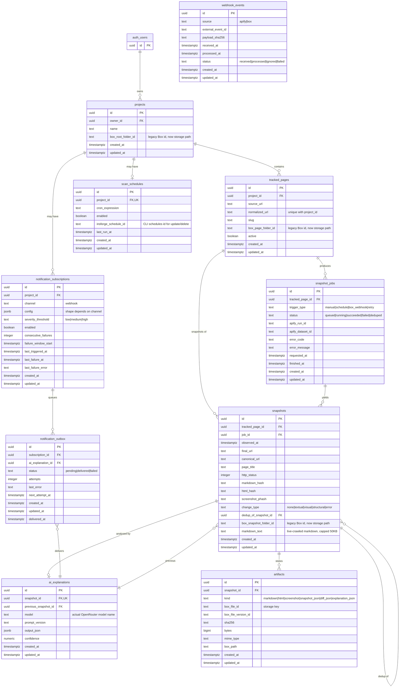

# PageVault — Entity-Relationship Diagram

> **Source of truth:** `db/schema.sql` (the canonical migration).
> This diagram is commentary, not a replacement.
> **Last updated:** 2026-06-05 · 10 tables, 1 transitive owner chain,
> 2 RPC wrappers.

## Mermaid ER diagram



## Ownership chain

The owner-of-record for every user-scoped table is `auth.users(id)`, but
the chain is transitive for the downstream tables — they reference
`projects.id`, which references `auth.users(id)`:

```
auth.users ── owner_id ──▶ projects ── project_id ──▶ tracked_pages ── tracked_page_id ──▶ snapshot_jobs
                                                ── tracked_page_id ──▶ snapshots ── id ──▶ ai_explanations
                                                                                    ── id ──▶ artifacts
```

```
projects ── project_id ──▶ scan_schedules
projects ── project_id ──▶ notification_subscriptions ── id ──▶ notification_outbox
```

`webhook_events` is intentionally **not** user-scoped — it is a
system-wide idempotency log for inbound webhooks from Apify and Box.
It has no RLS, no owner FK, and is written by edge functions and the
cron worker (not by user sessions).

## The "changes" user-facing concept

There is **no `changes` table**. The UI's "changes" list is a
JS-side join assembled in `lib/insforge.ts:listChanges`:

1. `tracked_pages` filtered by `project_id = roomId`
2. `snapshots` filtered by `tracked_page_id IN (...)`, newest first
3. `ai_explanations` filtered by `snapshot_id IN (...)`, with
   `output_json` parsed in JS (PostgREST returns it as a string)
4. Result rows carry `severity`, `changeType`, `summary`,
   `recommendedActions`, `evidence` — all read from `output_json`,
   with `changeType` falling back to `snapshots.change_type` when
   the JSON omits it.

The implicit "change" is therefore: *an `ai_explanations` row whose
`previous_snapshot_id` is non-null* (i.e. the LLM was actually
called, not the synthesized no-op). For no-op snapshots the scan
pipeline writes a synthetic `ai_explanations` row with
`severity='low'`, `change_type='none'`, `confidence=0.95` so the
list endpoint still returns something to render.

## Why `box_*` columns are kept

The columns `box_root_folder_id` (on `projects`),
`box_page_folder_id` (on `tracked_pages`),
`box_snapshot_folder_id` (on `snapshots`), and the
`box_file_id` / `box_file_version_id` / `box_path` triplet (on
`artifacts`) carry **InsForge Storage paths**, not Box file ids —
but the column names are kept for back-compat with `lib/insforge.ts`,
`lib/notifications.ts`, the SDK code paths, the seeded data, and
the dashboard. Renaming the columns would require a coordinated
rename across the type definitions, the lib code, and the seed
script. A future migration may rename them as part of a v2 cleanup
(see `docs/ARCHITECTURE.md` "Open questions").

## RLS scope

| Table | RLS enabled | Policy | Notes |
|---|---|---|---|
| `projects` | yes | `projects_owner_all` | direct `owner_id = auth.uid()` |
| `tracked_pages` | yes | `tracked_pages_owner_all` | via `projects.owner_id` |
| `snapshot_jobs` | yes | `snapshot_jobs_owner_all` | via `tracked_pages` → `projects` |
| `snapshots` | yes | `snapshots_owner_all` | via `tracked_pages` → `projects` |
| `artifacts` | yes | `artifacts_owner_all` | via `snapshots` → `tracked_pages` → `projects` |
| `ai_explanations` | yes | `ai_explanations_owner_all` | via `snapshots` → `tracked_pages` → `projects` |
| `scan_schedules` | yes | `scan_schedules_owner_all` | via `projects` |
| `notification_subscriptions` | yes | `notif_subs_owner_all` | via `projects` |
| `notification_outbox` | yes | `notif_outbox_owner_all` | via `notification_subscriptions` → `projects` |
| `webhook_events` | **no** | — | system table, written by edge functions and the cron worker |

**Reality check on RLS:** in the current Next.js code path the app
uses the anon or service-role key, both of which bypass RLS. The
policies are defensive-in-depth: the actual access boundary is the
`getRoom() + userId === session.user.id` check in each API route.
If per-user JWT auth is added later, these policies activate
without further migration work.

## Indexes worth knowing about

| Index | On | Used by |
|---|---|---|
| `idx_projects_owner` | `projects (owner_id)` | `listRoomsWithStats` |
| `idx_tracked_pages_project` | `tracked_pages (project_id)` | every room-detail query |
| `idx_tracked_pages_active` (partial) | `tracked_pages (project_id) WHERE active` | scan pipeline source-URL fetch |
| `idx_jobs_page_requested` | `snapshot_jobs (tracked_page_id, requested_at desc)` | latest-job lookup per page |
| `idx_jobs_status_requested` | `snapshot_jobs (status, requested_at desc)` | cron worker poll |
| `idx_snapshots_page_observed` | `snapshots (tracked_page_id, observed_at desc)` | previous-snapshot lookup in scan |
| `idx_snapshots_hashes` | `snapshots (markdown_hash)` | future: cross-room hash dedup |
| `idx_snapshots_change_type` | `snapshots (change_type)` | dashboard change-type filters |
| `idx_snapshots_job` | `snapshots (job_id)` | per-job cleanup |
| `idx_ai_model_created` | `ai_explanations (model, created_at desc)` | eval harness `scripts/eval_models.py` |
| `idx_schedules_enabled` (partial) | `scan_schedules (enabled) WHERE enabled` | cron poll |
| `idx_outbox_pending` (partial) | `notification_outbox (status, next_attempt_at) WHERE status='pending'` | delivery worker poll |
| `idx_webhooks_source_received` | `webhook_events (source, received_at desc)` | webhook handler dedup check |

## Migration ordering (for new environments)

If you are starting from a clean database, run `db/schema.sql` as a
single shot. The CREATE TABLE statements are already ordered by
dependency (parent tables first), so the file applies in one
transaction.

If you are running statement-by-statement via `db query`, observe
the section markers in the file — they are numbered 0–10 plus the
"Indexes" and "RLS" sections. Apply sections 1–10 in order, then
indexes, then the RPC helpers, then RLS. The 10-section split is
chosen so the multi-statement DDL pitfall in the insforge-cli
(everything in a single `db query` call may silently no-op) does
not affect this migration if you are forced to split it.
