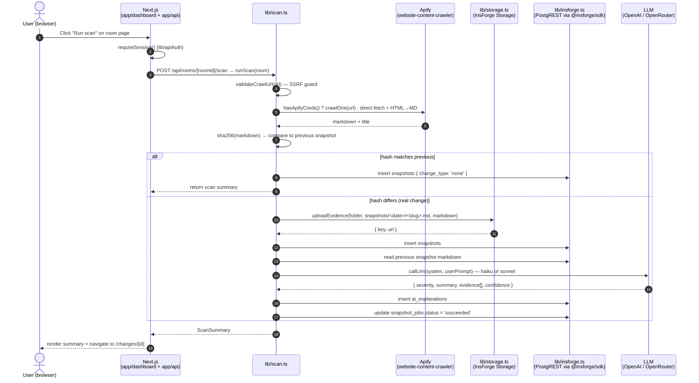

# PageVault — Technical Architecture

> **Last updated:** 2026-06-05 · intended to stay at 1–2 pages.
> **This is the system view.** Detailed implementation lives in `docs/SYSTEM_DESIGN.md`,
> `docs/DATA_MODEL.md`, `docs/API.md`, `docs/COMPONENTS.md`, `docs/DEPLOYMENT.md`,
> `docs/ENVIRONMENT.md` (per `docs/00-INDEX.md`).

## 1. Stack

| Layer | Choice | Justification |
| --- | --- | --- |
| Framework | **Next.js 15.5 App Router** (`package.json`) | Inherited from scaffold; RSC + route handlers + middleware in one runtime. |
| Language | **TypeScript 5.5** | Inherited. Catches the room/URL/scan-row shape mismatches at compile time. |
| UI | **React 18 + Tailwind 3.4** (pinned) | Inherited. Tailwind pinned to 3.4 because 4.x is a breaking change. |
| Backend | **InsForge** (Postgres + Auth + Storage + Schedules) | Single managed backend for DB, evidence storage, and cron — collapses three SaaS dependencies into one. |
| Web crawl | **Apify** `website-content-crawler` Actor | Inherited; falls back to a direct `fetch()` + HTML→Markdown in `lib/scan.ts` when `APIFY_*` creds are missing. |
| LLM | **OpenAI-compatible chat completions** | InsForge AI gateway proxies to OpenRouter (`anthropic/claude-3.5-haiku` by default; `OPENAI_API_KEY` direct is a fallback). Cascade pattern: haiku primary, sonnet on `severity=high` or `confidence<0.85`. |
| Auth | **NextAuth** (credentials provider + InsForge) | Inherited. Dev demo creds via `INSFORGE_DEV_INSECURE_SECRET`; production uses real NextAuth + InsForge JWT. |
| Storage evidence | **InsForge Storage** (bucket `pagevault-evidence`) | Holds raw markdown snapshots under `pagevault/<room>/snapshots/<date>/<slug>.md`. Card calls this "Box" — the **column** is still `box_root_folder_id` for back-compat, but the **backend** is InsForge Storage (see `lib/storage.ts`). |
| Test | **Vitest + fast-check** | Inherited. Property tests on the diff and validation modules. |

## 2. Module boundaries (`lib/*`)

The card listed `insforge, apify, box, ai, diff, scan, seed, env, validation`. The actual scaffold consolidates some of these — `apify` + `ai` are inlined into `lib/scan.ts` (crawler + analyzer), `box` is replaced by `lib/storage.ts` (InsForge Storage), and there is no `lib/seed.ts` (seeding is `scripts/seed_via_api.py`). The real `lib/` map is:

- **`lib/insforge.ts`** — The only data-access module. Wraps `@insforge/sdk` (`createClient({ baseUrl, anonKey })`) with a `sdkQuery(table, {select, filters, order, limit, offset})` helper. All DB reads/writes go through here. Implements the row-to-domain mappers (`toMemoryRoom`, `toWatchedUrl`, `toScanRun`, `toPageSnapshot`, `toChangeAnalysis`) and the multi-table list-changes join pattern.
- **`lib/scan.ts`** — The scan orchestrator. Owns `runScan(room)`: validates the crawl URL (SSRF guard — `validateCrawlUrl` blocks literal IPv4/IPv6 in 127/8, ::1, 169.254/16, 10/8, etc.), picks Apify vs direct-fetch, calls `extractExcerpt` to bound prompt size, hashes content with `lib/diff`, uploads evidence via `lib/storage`, persists `snapshots` + `ai_explanations` rows, and updates `snapshot_jobs.status` to `succeeded`. Also inlines the OpenAI/OpenRouter call (`callLlm`) with placeholder-key detection.
- **`lib/storage.ts`** — InsForge Storage wrapper. Exports `EVIDENCE_BUCKET = 'pagevault-evidence'`, `STORAGE_ROOT = 'pagevault'`, `hasStorageCreds()`, and `createStorageFolder(name, parentPath?)`. Uploads always persist **both** `url` and `key` (the `key` is required for RLS-protected reads).
- **`lib/diff.ts`** — Pure functions for change detection: `normalizeText`, `hashContent` (SHA-256), `hasMeaningfulChange(previous, current)` (cheap pre-LLM gate), and `extractSimpleDiff` for the human-readable excerpt.
- **`lib/validation.ts`** — Zod-free input validation for room and URL create/update forms. Exports `validateRoomField`, `validateUrlEntry`, `validateUrlBatch`, `frequencyToCronExpression`, `buildWatchedUrlRows`. All errors returned as `ValidationResult<T>` for the route handler to map to 400s.
- **`lib/auth.ts`** — NextAuth config: `authOptions` (credentials provider), `resolveNextAuthSecret()`, dev-demo opt-in constants, `tryDevDemoAuth` / `signInWithInsForge`. Throws on startup if `NEXTAUTH_SECRET` is missing in production.
- **`lib/apiAuth.ts`** — `requireSession()` helper for route handlers. Returns either the session or a `NextResponse` 401, so route code stays linear.
- **`lib/cron-auth.ts`** — `requireCronSecret(request)` for `app/api/cron/*` routes. Discriminated result: 503 service_unconfigured vs 401 unauthorized.
- **`lib/notifications.ts`** — The outbox: `enqueueNotification` (called from scan on a real change), `drainOutbox(limit)` (the cron worker reads pending rows, dispatches webhooks/email, records success/failure), and a `dbRpc` helper that talks to the `public` security-definer wrappers (PostgREST can't call `pg_*` directly).
- **`lib/env.ts`** — Credential detection: `getInsforgeClient()`, `hasApifyCreds()`, `hasAiCreds()`, `getInsforgeBaseUrl()`. A credential is "present" only when it is a non-empty string after trimming — malformed values are still treated as present so they surface as real-call errors, not silent fallbacks.

## 3. Data flow — manual scan (User → API)

The same `runScan(room)` is invoked by the **scheduled** path (`/api/cron/scan-all`, authenticated via `x-cron-secret` header) — that route iterates rooms with `frequency_cron` set, fans out with `MAX_CONCURRENT=3`, and updates `last_run_at` on each.

## 4. Deployment topology

| Component | Where it runs | Trigger |
| --- | --- | --- |
| Next.js app (UI + API routes) | **Vercel** (or any Node host that can run Next 15) | HTTP from browsers, plus HTTPS to InsForge Schedules cron |
| Postgres (`projects`, `tracked_pages`, `snapshots`, `ai_explanations`, `snapshot_jobs`, `notification_outbox`, `notification_subscriptions`) | **InsForge managed Postgres** at `wga6k9at.us-east.insforge.app` | SDK + PostgREST at `/api/database/records/{table}` |
| Evidence storage (`pagevault-evidence` bucket) | **InsForge Storage** | SDK `client.storage.from(...).upload(...)` from `lib/storage.ts` |
| Scheduled scans | **InsForge Schedules** cron job → POSTs `/api/cron/scan-all` with `x-cron-secret` | Cron tick (e.g. every 15 min) |
| Notification worker | **InsForge Schedules** cron job → POSTs `/api/cron/notification-worker` | Cron tick (e.g. every 5 min) |
| Web crawl (Apify) | **Apify cloud** (`api.apify.com`) | `lib/scan.ts` calls Apify REST when `APIFY_*` creds present; falls back to direct fetch otherwise |
| LLM | **OpenAI API** (when `OPENAI_API_KEY` real) or **OpenRouter** via InsForge AI gateway (default — set up with `npx @insforge/cli ai setup`) | `lib/scan.ts` `callLlm()` |

The Vercel → InsForge pairing was the design intent (see `docs/DEPLOYMENT.md`). Any Node host works as long as it can reach `INSFORGE_API_URL`, `api.apify.com`, and the LLM base URL.

## 5. Key trade-offs

- **Evidence is durably stored in InsForge Storage on every change** (not a CDN or a signed S3 URL). Apify/Inference/UI latency in the critical path is acceptable because evidence durability is non-negotiable for a "memory" product; alternatives considered were S3 + pre-signed URLs (rejected: loses the InsForge-managed RLS story) and local-disk (rejected: not durable across Vercel function invocations).
- **PostgREST multi-call JOIN in JS** (3 sequential PostgREST calls + JS join in `lib/insforge.ts listChanges`) instead of a SQL JOIN or an RPC. Rejected alternatives: a PostgREST `rpc` wrapper function (rejected: adds a migration and a deploy step for a query that only runs on the changes page), and pushing the join down to a view (rejected: RLS posture makes view-based authz hard to reason about). The 3-call cost is bounded by `limit=100` and the page only renders once per room view.
- **Direct `fetch()` HTML→Markdown fallback** in `lib/scan.ts` when Apify creds are missing (inherited from scaffold). Rejected alternatives: always-required Apify (rejected: blocks local dev), and a heavyweight HTML→MD library like Turndown at the route layer (rejected: ships more bytes for an identical result on most pages). The fallback is intentionally simple — it's a dev convenience, not a production crawler.
- **LLM is a black box inside `lib/scan.ts`** rather than its own module. Rejected: a separate `lib/ai.ts` would have been more testable, but the prompt is co-evolved with the scan pipeline (excerpt sizing, severity escalation rules) and pulling it out hid more than it revealed. `callLlm` is a private function with a clear signature; the test surface is the public `runScan` end-to-end tests.

## 6. Open questions (blocking downstream cards)

1. **Storage naming.** The DB column is `box_root_folder_id` and the card calls the storage "Box". The actual backend is InsForge Storage (per `lib/storage.ts`). Do we (a) keep the column name forever for back-compat, (b) add a `storage_root_path` column and dual-write, or (c) rename and write a one-time migration? **Affects:** t_77c7b919, t_9c78688a (any consumer that reads/writes this column).
2. **Auth provider.** Currently NextAuth credentials-only. Card t_77c7b919 may need OAuth (GitHub/Google) before multi-user. Until then the `auth.users(id)` reference in RLS policies never fires (the app uses anon/service-role keys that bypass RLS — see insforge skill "RLS reality check"), so authz is enforced in app code via `getRoom()` + `userId` checks.
3. **Seed strategy.** The scaffold has no `lib/seed.ts`. Seeding today is `scripts/seed_via_api.py` (Python + service-role key against the public PostgREST endpoint — the only reliable path because of cross-session DB isolation between the CLI and the SDK). Should we (a) keep the Python script, (b) add a `/api/admin/seed` route gated by `CRON_SHARED_SECRET`, or (c) move seeding into a TS module called from a CLI script? **Affects:** t_9c78688a (any test that needs deterministic seed data).
4. **DB schema drift between docs and reality.** `SYSTEM_DESIGN.md` and `DATA_MODEL.md` are out of date in places (`snapshots.created_at` doesn't exist — use `observed_at`; `ai_explanations` has no `severity` column — read from `output_json`). The scan pipeline was already corrected; the docs still need a pass.
5. **Cascade escalation policy.** `lib/scan.ts callLlm` picks haiku-or-sonnet today, but the prompt doesn't yet drive the "if confidence < 0.85, retry with sonnet" path — that's a deferred TODO in the scan pipeline. The card t_9c78688a likely needs this before the AI gateway is used in production traffic.
